# Architecture

A new-contributor map of how Khayyam Math turns a one-line prompt
into a voice-narrated SVG figure. Read this before opening a
non-trivial PR.

The system has grown into eleven deterministic figure routes, an
embedding-indexed category→template taxonomy with answer-cache
retrieval and an offline curation loop, a graph-conditioned
discrete-diffusion neural layout module, a five-tier math-correctness
verifier, an FDL (Figure Description Language) extractor with ten
composable primitives, a three-case refinement model, and a
magic-link-auth FastAPI service deployed on AWS Fargate. This doc is
the top-down map; the deep-dives live
under `docs/`.

## Table of contents

1. [Subsystems at a glance](#subsystems-at-a-glance)
2. [Request lifecycle](#request-lifecycle)
3. [The express pipeline (ten routes, in order)](#the-express-pipeline-ten-routes-in-order)
4. [The refinement model (Case A / B / C)](#the-refinement-model-case-a--b--c)
5. [Math-correctness chain (five tiers)](#math-correctness-chain-five-tiers)
6. [Narration synthesis + highlight matching](#narration-synthesis--highlight-matching)
7. [Language localiser](#language-localiser)
8. [Frontend (Studio + canvas viewer)](#frontend-studio--canvas-viewer)
9. [Auth (magic link)](#auth-magic-link)
10. [Storage + rehydration](#storage--rehydration)
11. [Deploy topology (AWS Fargate)](#deploy-topology-aws-fargate)
12. [Deploy topology (self-hosted)](#deploy-topology-self-hosted)
13. [Where to find things (file-level map)](#where-to-find-things-file-level-map)
14. [Non-goals](#non-goals)

---

## Subsystems at a glance

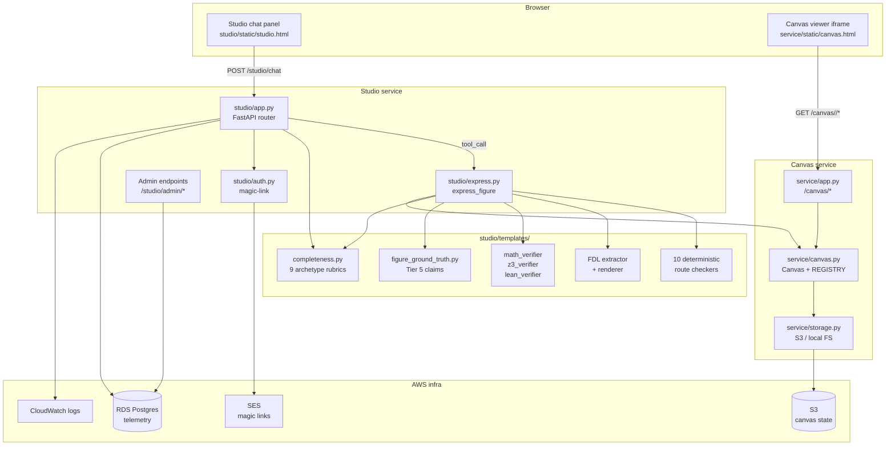

Sizes (lines of Python, today):

| Module | LOC | Purpose |
|---|---:|---|
| `studio/express.py` | ~7,700 | Figure pipeline. Single entry point. Routes, structural critic, vision review, narration synthesis. |
| `studio/app.py` | ~2,300 | FastAPI router, chat loop, magic-link auth, admin endpoints. |
| `studio/templates/fdl.py` | ~1,400 | Figure Description Language: ten primitives + extractor + renderer. |
| `service/canvas.py` | ~900 | `Canvas` object + REGISTRY + S3 rehydration. |
| `studio/templates/completeness.py` | ~660 | Pedagogical-depth gate: nine archetype rubrics + classifier + critic + brief generator. |
| `service/app.py` | ~640 | `/canvas/*` HTTP surface for the viewer iframe. |
| `studio/auth.py` | ~270 | Magic-link cookie auth via SES. |
| Other templates | ~6,000 | newton, volumes, fraction, geometry, graph, graphviz, graph_homomorphism, matrix, matplotlib_route, panels_route, plotly_render, primary, process_route, sequential_route, symbolic_route, table, trig, venn, algorithm_trace. |

Tests: 328 collected (`tests/`, `studio/`, `khayyam_math/tests/`).

---

## Request lifecycle

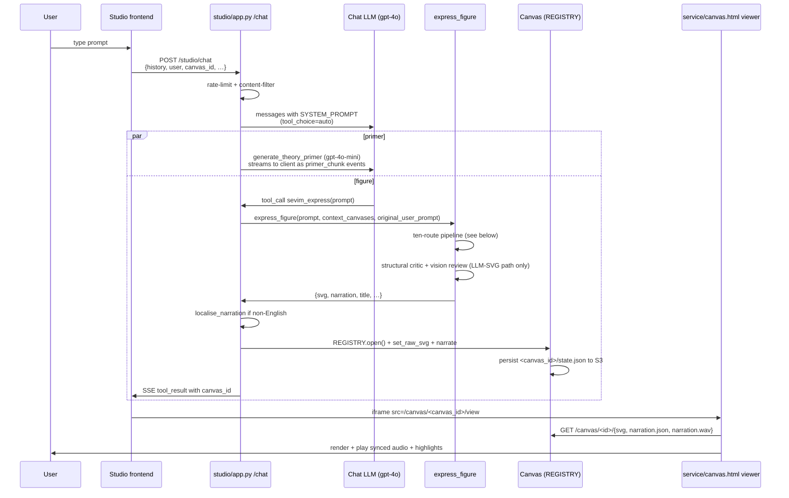

Key callouts:

- `tool_choice="auto"` since 2026-05-31 — the chat-LLM can reply
  in chat without drawing, ask a clarifying question, or both.
  The SYSTEM_PROMPT's DECISION RULE biases it toward drawing on
  math prompts.
- The primer (3-12 sentence theoretical intro) streams concurrently
  with the figure. The user reads/hears the intro while the figure
  renders.
- The chat-loop auto-attaches `req.canvas_id` to
  `args["context_canvas_ids"]` whenever a canvas is on screen; the
  refinement model below decides what to do with it.
- The user's literal message is threaded through as
  `args["_original_user_prompt"]` so deterministic-route routing
  doesn't get hijacked by chat-LLM paraphrases.

---

## The express pipeline (ten routes, in order)

`studio/express.py:express_figure` is the single figure entry
point. Routes fire in a fixed order; the first match wins and
returns immediately. Every route is gated on:

- An env var `SEVIM_<ROUTE>_ROUTE` (so a misbehaving route can be
  shut off in production without a code change).
- The `_refining` flag — when the user is making a narrow Case A
  targeted edit on a prior canvas, every deterministic route is
  skipped and the LLM-SVG path with REFINEMENT MODE handles it.

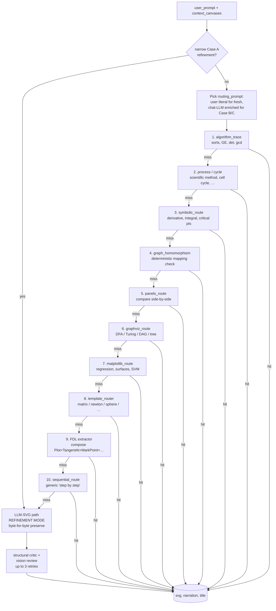

Route descriptions:

| # | Route | File | Catches |
|---|---|---|---|
| 1 | `algorithm_trace` | `templates/algorithm_trace.py` | "Show bubble sort step by step", Gaussian elimination, determinant cofactor expansion, gcd via Euclid. Computes every intermediate state in Python; renders a deterministic vertical stack. |
| 2 | `process_route` | `templates/process_route.py` | "Cell cycle", "scientific method", "Krebs cycle", "water cycle". Cyclic (ring) or linear (vertical) flow. |
| 3 | `symbolic_route` | `templates/symbolic_route.py` | Derivatives, gradients, Hessians, integrals, limits, "find and classify critical points". SymPy solves exactly; matplotlib typesets. |
| 4 | `graph_homomorphism` | `templates/graph_homomorphism.py` | Two graphs + mapping f: V(G) → V(H), deterministic O(|E_G|) homomorphism verifier before rendering. |
| 5 | `panels_route` | `templates/panels_route.py` | "Compare X and Y side-by-side". Decomposes into sub-figures and composites a grid; recurses into `express_figure` per panel with `allow_panels=False`. |
| 6 | `graphviz_route` | `templates/graphviz_route.py` | DFA / NFA / Turing-machine / DAG / tree / Hasse / Cayley / Petersen / generic state machines. LLM emits DOT; `dot -Tsvg` renders. |
| 7 | `matplotlib_route` | `templates/matplotlib_route.py` | Regression, decision boundaries, SVM, function curves, 3-D surfaces, contour plots. LLM emits a closed-vocabulary plot spec; server-side matplotlib renders. **No exec of LLM code.** |
| 8 | `template_router` | `templates/router.py` | Per-template classifier (gpt-4o-mini). Routes to `matrix_multiplication`, `matrix_transpose`, `matrix_determinant`, `matrix_inverse`, `system_of_equations`, `state_diagram`, `pythagoras`, `number_line`, `data_table`, `adjacency_matrix`, `place_value`, `multiplication_array`, `venn_diagram`, `fraction`, `unit_circle`, `triangle`, `newton_method`, `volume_of_sphere`, `volume_of_cone`. Each template is a pure-Python `(args) → (svg, narration)` function. |
| 9 | `FDL extractor` | `templates/fdl.py` | Composes the figure from ten primitives: `Plot`, `AxisMark`, `MarkPoint`, `TangentAt`, `Caption`, `Secant`, `Intersection`, `ShadeUnder`, `RegionBetween`, `Vector`. Tangent slopes are SymPy-computed by construction; cluster zoom handles tight-convergence iterates. |
| 10 | `sequential_route` | `templates/sequential_route.py` | Generic "step-by-step" prompts that no deterministic template caught. Decomposes into ordered steps, recurses per step with `allow_sequential=False`. Last in line by design. |

When all ten miss, the **LLM-SVG fallback** runs: gpt-4o emits a
self-contained `{svg, narration, title, math_claims}` JSON; a
structural critic + vision review + retry loop (up to 3) gate
the result.

For the deep-dive (per-route classifier rules, FDL primitive
catalog, "how to add a new template"), see
[`docs/PIPELINE.md`](docs/PIPELINE.md).

---

## Category→template taxonomy (recognition, retrieval, curation)

A learned layer sits on top of the fixed cascade. Full design in
[`docs/TEMPLATE_TAXONOMY_PLAN.md`](docs/TEMPLATE_TAXONOMY_PLAN.md).

- **Embeddings** (`sevim/embeddings.py`) — `text-embedding-3-small` via
  httpx, hash-cached, degrades to `None` without a key.
- **Answer cache** (`studio/answer_cache.py`, `SEVIM_ANSWER_CACHE`) —
  a numpy cosine index over accepted canvases (`canvas_index` table).
  A near-identical prompt retrieves the prior accepted figure instead
  of regenerating it (consistency + speed). Fails closed; checked at
  the top of `express_figure`, before the cascade.
- **Taxonomy + recognition** (`studio/taxonomy.py`, `SEVIM_TAXONOMY`) —
  `categories`/`templates`/`template_examples` tables; two-level
  recognition (nearest category centroid → nearest template). A
  *renderer* template is a parameterized program; an *exemplar* is a
  curated figure retrieved + adapted. Renderer matches stay advisory
  (the cascade is the authority); exemplar matches are served.
- **Curation** (`studio/curation.py`, admin `/studio/admin/taxonomy`) —
  offline: find gaps → cluster → propose candidate → cross-category
  dedup → migration suggestions → promote (admin-approved, gated by the
  quality gate). Never mutates the live taxonomy at request time.
- **Renderer-first** — `studio/templates/np_completeness.py` is the
  first conversion of an open-ended class (NP-completeness proofs) into
  a deterministic renderer (route #1, `SEVIM_NPC_ROUTE`).

The cache/taxonomy/curation layers ship behind flags (default off)
until thresholds are tuned on the live corpus; the NP-completeness
renderer ships on.

---

## The refinement model (Case A / B / C)

When the user follows up on a canvas already on screen, the
chat-loop attaches the prior canvas to the express call. What
the express loop does with it depends on **which of three cases**
the new request is:

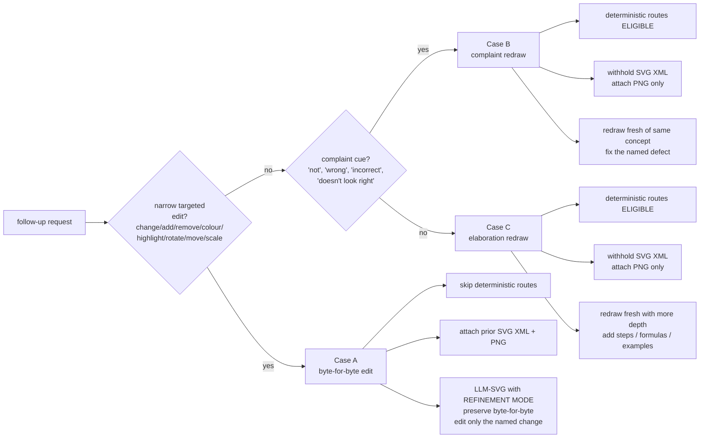

| Case | Cue examples | _refining | SVG XML attached | Narration |
|---|---|:---:|:---:|---|
| **A — narrow edit** | "change the curve colour to red", "add a label x_3", "remove the green tangent", "rotate the triangle 45 degrees" | ✅ | ✅ | only the NEW phrases for this turn |
| **B — complaint** | "these are not tangent lines", "the slope is wrong", "still not right", "the points overlap" | ❌ | ❌ (PNG only) | short 1-3 phrases acknowledging the redraw |
| **C — elaboration** | "explain visually", "with proper formulas", "in more detail", "step by step", "expand on this", "add a worked example" | ❌ | ❌ (PNG only) | full 5-7 phrases walking the elaboration |

Topic switch (no refinement cue) → context_canvases stays empty
→ the deterministic templates fire fresh against the new prompt.
A bare "show me the Pythagorean theorem" after a Newton canvas
routes to the Pythagoras template untouched.

Implementation:

- Frontend always sends `req.canvas_id` for the on-screen canvas.
- `studio/app.py` chat-loop always appends it to
  `args["context_canvas_ids"]` (no keyword gate as of 2026-05-31).
- `studio/express.py` `_execute_tool` loads the prior canvas via
  `REGISTRY.get(prior_id)`, which transparently rehydrates from
  S3 if the in-memory cache misses (ECS task replacement-safe).
- `looks_like_refinement(original_user_prompt or prompt)` regex
  filters out clear topic switches; if it returns False,
  `context_canvases` is dropped.
- `is_narrow_targeted_edit(prompt)` regex classifies Case A.
- `_build_user_content` chooses XML+PNG (Case A) vs PNG-only
  (Case B/C) based on that classifier.
- `routing_prompt` uses the chat-LLM's enriched prompt on Case B/C
  (which carries the bundled topic from history) and the user's
  literal on fresh prompts (which avoids paraphrase hijacks).

Full worked multi-turn example is in
[`docs/REFINEMENT.md`](docs/REFINEMENT.md).

---

## Math-correctness chain (five tiers)

A wrong figure is worse than no figure: it teaches something
false. Every claim a figure makes is verified before the figure
ships. Each tier is more rigorous than the last; the chain
escalates only as far as needed.

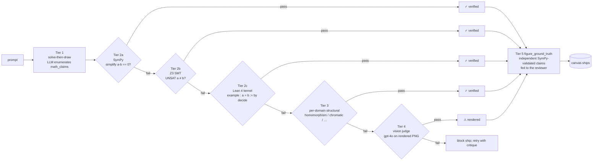

| Tier | Where | What it catches |
|---|---|---|
| 1 — solve-then-draw | `_EXPRESS_SYSTEM` | LLM must commit to a checkable `math_claims` list before drawing. |
| 2a — SymPy | `studio/templates/math_verifier.py` | Algebra, calculus, trig identities (~78% of claims). |
| 2b — Z3 SMT | `studio/templates/z3_verifier.py` | Nonlinear arithmetic, quantified (~11%). |
| 2c — Lean 4 kernel | `studio/templates/lean_verifier.py` | Decidable Nat/Bool/Fin (~3%). |
| 3 — per-domain | e.g. `templates/graph_homomorphism.py` | Named-template invariants. |
| 4 — vision-judge | `_vision_review` in `express.py` | Geometric impossibilities and intuitive misstatements. |
| 5 — figure ground truth | `templates/figure_ground_truth.py` | Independent SymPy-validated claims fed into the vision auditor. |

Offline Mathlib catalog runner at
`studio/catalog_verifier.py` catches the residual ~6% by
`ring_nf`, named trigonometric lemmas, `linarith` — failures
write to the `lean_verifications` table and surface at
`/studio/admin/lean`. Catalog failures **tag**, never block.

Deep-dive: [`docs/MATH_CORRECTNESS.md`](docs/MATH_CORRECTNESS.md)
and [`docs/QUALITY_GATES.md`](docs/QUALITY_GATES.md).

---

## Completeness — pedagogical-depth gate (nine archetypes)

The verifier chain above checks whether an answer is RIGHT. The
completeness gate checks whether an answer is DEEP ENOUGH. A
right-but-shallow answer (a one-sentence response to "explain
Newton's method step by step in an example") doesn't ship.

The model is three-axis: an answer is complete when (cognitive
level × structural depth × representational forms) match the
question's pedagogical contract. The three axes collapse into one
of **nine archetypes** the classifier picks per turn.

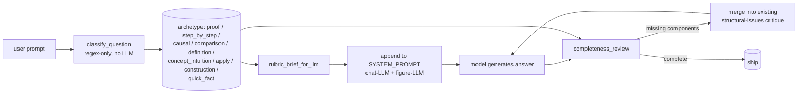

Each archetype has a rubric: required components + narration
phrase range + primer word range. Detection is lenient regex on
the combined (primer + narration + chat reply) text.

| Archetype | Match cue | Required components | Narration | Primer |
|---|---|---|---:|---:|
| `quick_fact` | *evaluate / compute / simplify* | statement | 1-2 | 15-60 |
| `concept_definition` | *what is / define* | statement, paraphrase | 2-4 | 60-140 |
| `concept_with_intuition` | *explain / how does X work* | statement, intuition, takeaway | 3-5 | 100-200 |
| `apply_worked_example` | *show / use ... to ... / with an example* | statement, worked example, takeaway | 4-6 | 120-220 |
| `step_by_step` | *step by step / walk me through / in detail* | + sequence_of_steps + worked example | 6-9 | 150-280 |
| `causal_explanation` | *why / how come / intuition* | + causal chain + link to prior | 5-8 | 150-260 |
| `comparison` | *compare / difference between* | criteria, tabulation, takeaway | 4-7 | 70-200 |
| `proof` | *prove / show that / derive* | statement, full deduction, QED | 5-9 | 160-320 |
| `construction` | *construct / design / find an X such that* | construction steps, verification | 5-8 | 140-260 |

Two wiring points:

- The classifier runs once per turn in **both**
  `studio/app.py:_stream_vllm_chat` (so the chat-LLM is briefed on
  what "complete" means before deciding to reply-in-chat or
  tool-call) and `studio/express.py:express_figure` (so the figure
  LLM sees the brief in its system prompt).
- The critic runs after every LLM-SVG attempt, parallel to
  `_structural_review`. Issues feed the same retry critique.

Gate: `SEVIM_COMPLETENESS_CRITIC` (default: on). Off disables both
the brief and the critic — useful for A/B telemetry comparisons.

Deep-dive: [`docs/COMPLETENESS.md`](docs/COMPLETENESS.md).

---

## Narration synthesis + highlight matching

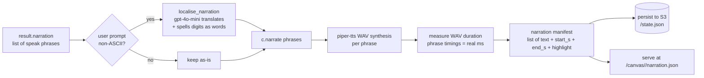

Highlight ids per phrase come from one of two paths:

- **Deterministic templates** hardcode the ids that exist in their
  SVG output. The newton_method template emits `id="curve"`,
  `id="tangent_0..n"`, `id="x_0_label..x_n_label"` and pins each
  narration phrase to the relevant id.
- **FDL** extracts the bare narration strings from the LLM, then
  `_phrase_highlights` scans each phrase for `x_n` / `x sub n` /
  `x naught` / `x₀-x₉` patterns and emits `mark_n`, `tangent_n`,
  `secant_n`, `x_axis`, `y_axis`, `curve_<label>` ids that
  actually exist in the rendered SVG. Spelled-out digits
  ("x naught", "x sub one") are matched so the localised non-English
  narration also fires highlights.

Phrase timings are **measured** off the synthesised WAV, never
estimated (memory `feedback_narration_word_accurate`). The viewer
animates the highlight transitions to match the spoken cursor.

---

## Language localiser

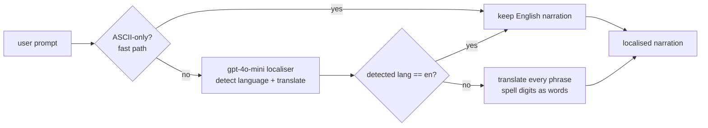

- Fast-path: a pure-ASCII prompt skips the LLM round-trip. Math
  symbols (π, ∫, √) are allowed; only non-ASCII LETTERS trigger
  the LLM call.
- The localiser is told to default to English if the prompt is
  ambiguous; if it returns `language: "en"`, the original phrases
  pass through verbatim (defence against the model hallucinating
  Spanish on an English prompt — verified live regression).
- Non-English narration spells digits out as words ("eineinhalb",
  "یک و نیم", "一点五") so the downstream TTS doesn't swallow them.
- Disable with `SEVIM_LOCALISE_NARRATION=off`.

System-prompt LANGUAGE RULE is appended to `_EXPRESS_SYSTEM`,
`_PRIMER_SYSTEM`, FDL `_EXTRACTOR_SYSTEM`, and Graphviz
`_NARRATE_GRAPHVIZ_SYSTEM`. The post-processor catches the
remaining drift.

---

## Frontend (Studio + canvas viewer)

Two separate HTML surfaces, communicating via `postMessage` and
SSE:

| File | Role |
|---|---|
| `studio/static/studio.html` | The chat panel + iframe holder. Posts to `/studio/chat`, streams SSE, owns the chat history and pinned-canvas list. |
| `service/static/canvas.html` | The figure viewer. Lives in an iframe. Loads `/canvas/<id>/{svg, narration.json, narration.wav}`, plays the WAV, animates highlights, dispatches "Play narration" / "Not quite right?" buttons. |

The chat panel **never** touches the SVG directly. The canvas
viewer **never** sees the conversation history. They coordinate
by `canvas_id` — when express returns a new canvas_id, the chat
panel swaps the iframe src.

Mobile note: iOS Safari clears the SVG on tab switch. The viewer
recovers via `localStorage` + canvas-id lookup
(memory `feedback_canvas_must_be_slidable`).

---

## Auth (magic link)

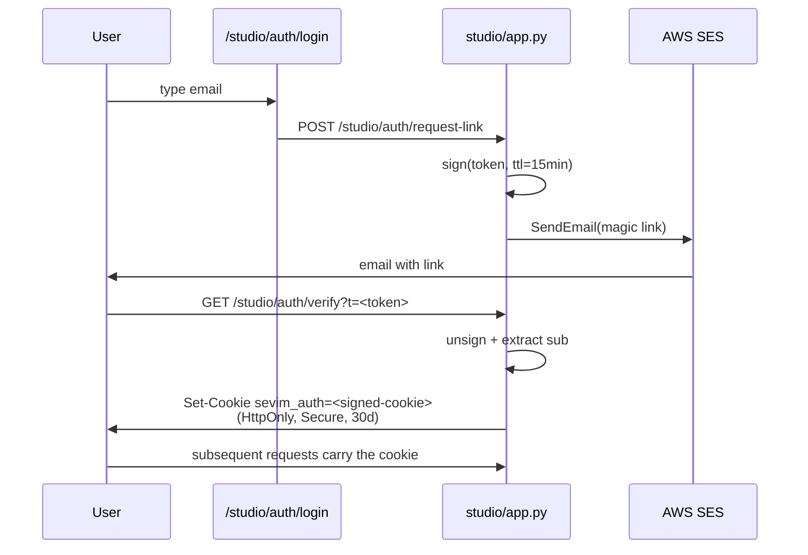

- Tokens and cookies are HMAC-SHA256 signed envelopes (no
  external dep). `studio/auth.py:sign` / `unsign`.
- Secret loaded from AWS Secrets Manager: `sevim/auth_secret`.
- `SEVIM_AUTH_REQUIRED=1` in production; off by default in dev so
  local `python -m studio` works without SES.
- Never disable auth in production
  (memory `feedback_keep_magic_link_auth`).

---

## Storage + rehydration

ECS Fargate tasks are stateless. The `REGISTRY` in
`service/canvas.py` holds canvas objects **in memory**, with a
durable `<canvas_id>/state.json` blob on every mutation:

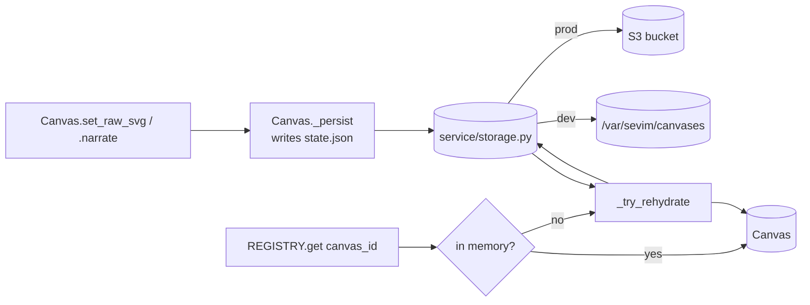

So `REGISTRY.get(prior_id)` works **across ECS task replacement**:
the new task starts with an empty REGISTRY, but S3 still has the
prior canvas's state. The conversation-awareness model relies on
this — without rehydration, refinement after a deploy would
404.

`state.json` carries: `svg`, `raw_svg_ids`, `revision`,
`created_at`, `updated_at`, `genesis_prompt`, `narration_manifest`,
`transition_text`, `owner`, `math_mode`, `animate`,
`width`/`height`.

---

## Deploy topology (AWS Fargate)

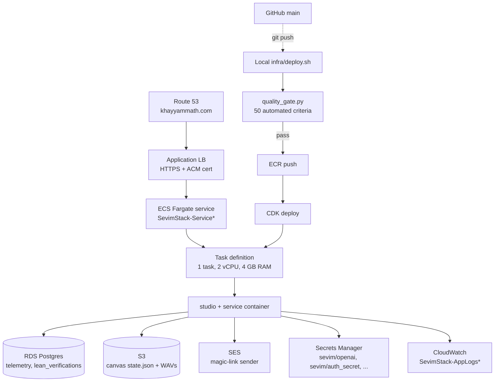

- Account: **332504859695** in **us-east-1**.
- Profile: **`AWS_PROFILE=sevim`** (the `default` profile points
  at a different unrelated account — memory
  `feedback_deploy_wrapper`).
- Stack name: **`SevimStack`**.
- CDK in `infra/`, Python.
- **Always deploy via `infra/deploy.sh`**, never bare `cdk deploy`.
  The wrapper exports the env-var contract the stack expects
  (`SEVIM_DOMAIN`, `CDK_DEFAULT_*`, `AWS_PROFILE`) and runs the
  quality gate before invoking CDK.
- Runbook: [`docs/DEPLOY.md`](docs/DEPLOY.md).

This topology is still fully supported. `infra/` is unmodified by the
self-hosting work below, and the tag `aws-production-final` marks the
commit the Fargate service was last running.

---

## Deploy topology (self-hosted)

An alternative topology that runs the identical container on a single
machine with no AWS bill. Both are supported by the same source tree;
which one you get is decided entirely by environment variables.

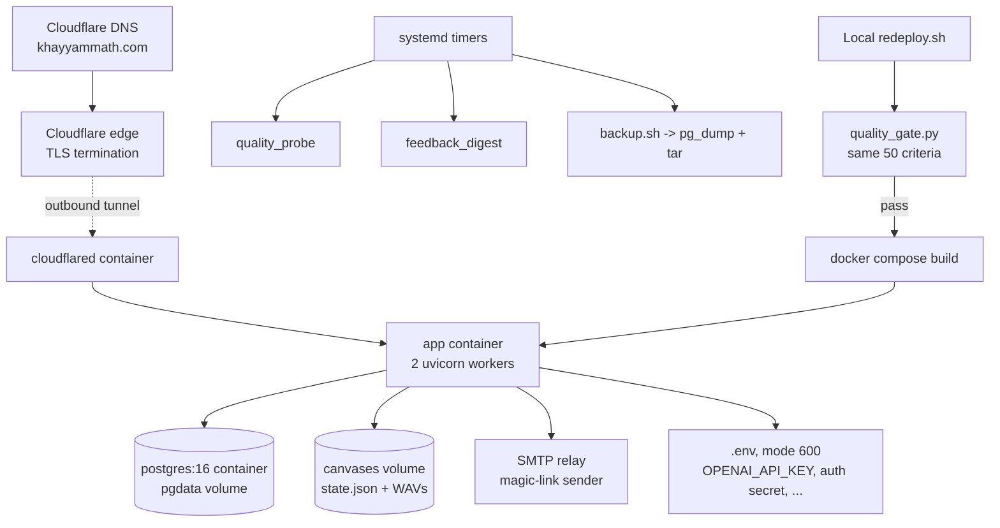

The tunnel dials **out** to Cloudflare, so no inbound port is opened and
a dynamic residential IP is irrelevant — that is what makes ALB + ACM +
Route 53 redundant rather than merely replaced.

Which topology the code takes is a function of four env vars:

| Env var | AWS | Self-hosted |
|---|---|---|
| `AWS_REGION` | set → Secrets Manager | unset → `.env` |
| `SEVIM_STORAGE_URL` | `s3://…` → `S3Storage` | unset → `FileStorage` |
| `SEVIM_SMTP_HOST` | unset → SES backend | set → SMTP backend |
| `SEVIM_TELEMETRY_DB` | RDS secret JSON | `postgresql://…@db` |

No code branches on "am I on AWS" beyond these. Reverting is therefore
a configuration change, not a migration.

- Everything lives in `deploy/selfhost/`.
- Runbook: [`deploy/selfhost/README.md`](deploy/selfhost/README.md).

---

## Where to find things (file-level map)

| Capability | File |
|---|---|
| Studio chat endpoint | `studio/app.py` (`@router.post("/chat")`) |
| Chat-loop tool-call streaming | `studio/app.py` (`_stream_vllm_chat`) |
| Auth (magic link) | `studio/auth.py` + endpoints in `studio/app.py` |
| Admin endpoints | `studio/app.py` (`@router.get("/admin/*")`) |
| Express pipeline | `studio/express.py` (`express_figure`) |
| Structural critic | `studio/express.py` (`_structural_review`) |
| Vision review | `studio/express.py` (`_vision_review`) |
| Refinement Case A classifier | `studio/express.py` (`is_narrow_targeted_edit`) |
| Refinement detector | `studio/express.py` (`looks_like_refinement`) |
| Language localiser | `studio/express.py` (`localise_narration`) |
| Primer | `studio/express.py` (`generate_theory_primer`) |
| FDL primitives + extractor + renderer | `studio/templates/fdl.py` |
| FDL highlight matcher | `studio/templates/fdl.py` (`_phrase_highlights`) |
| Template router (per-template classifier) | `studio/templates/router.py` |
| Newton template | `studio/templates/newton.py` |
| Sphere / cone volume templates | `studio/templates/volumes.py` |
| Matrix templates | `studio/templates/matrix.py` |
| Pythagoras, unit circle, triangle, fractions | `studio/templates/{geometry,trig,fraction}.py` |
| Algorithm trace (sort/GE/det/gcd) | `studio/templates/algorithm_trace.py` |
| Process / cycle template | `studio/templates/process_route.py` |
| Symbolic route (derivative/integral) | `studio/templates/symbolic_route.py` |
| Panels (compare side-by-side) | `studio/templates/panels_route.py` |
| Graphviz route | `studio/templates/graphviz_route.py` |
| Matplotlib route | `studio/templates/matplotlib_route.py` |
| Graph homomorphism deterministic check | `studio/templates/graph_homomorphism.py` |
| Sequential step-by-step (fallback) | `studio/templates/sequential_route.py` |
| Plotly interactive embed | `studio/templates/plotly_render.py` |
| Figure ground truth (Tier 5) | `studio/templates/figure_ground_truth.py` |
| Math verifier (Tier 2a) | `studio/templates/math_verifier.py` |
| Z3 verifier (Tier 2b) | `studio/templates/z3_verifier.py` |
| Lean kernel verifier (Tier 2c) | `studio/templates/lean_verifier.py` |
| Offline Mathlib catalog verifier | `studio/catalog_verifier.py` |
| Lean translation prompts | `studio/templates/lean_translator.py` |
| Completeness classifier + critic + brief | `studio/templates/completeness.py` |
| Canvas object + REGISTRY | `service/canvas.py` |
| Canvas viewer (browser) | `service/static/canvas.html` |
| Canvas HTTP endpoints | `service/app.py` |
| Storage backend (S3 / local FS) | `service/storage.py` |
| Studio (chat panel) frontend | `studio/static/studio.html` |
| Landing page | `service/static/landing.html` |
| Telemetry | `studio/sessions.py`, `sevim/telemetry.py` |
| Quality gate (pre-deploy) | `infra/quality_gate.py` |
| AWS deploy (CDK) | `infra/` (Python CDK), `infra/deploy.sh` wrapper |
| Demo screenshots | `service/static/screenshots/` |
| Public client SDK | `khayyam_math/` |
| Neural-layout research | `studio/neural_layout/` |
| Tests | `tests/`, `studio/templates/test_*.py`, `khayyam_math/tests/` |

---

## Non-goals

These are deliberate non-goals, not omissions. Don't propose PRs
to reverse them without an issue discussion first.

- **No model training in production.** All fine-tuning runs on a
  local GPU. Only inference (gpt-4o + the optional fine-tuned
  Qwen via vLLM) runs on AWS.
- **No new "better SVG-from-LLM" paradigm.** When a deterministic
  tool exists for a figure shape, we use it. The LLM-SVG path is
  the fallback, not the goal.
- **No knowledge-graph back-end.** Earlier work (Sevim v0.1-0.2)
  had one; collapsed to the single `sevim_express` tool because
  graph extraction was the failure mode, not the value.
- **No PyPI publish.** Install via `git+` or `git clone + python
  -m studio` (memory `project_no_pypi`).
- **No Khayyam Math in the JAIR paper title.** Paper authorship
  uses the system name without the product brand (memory
  `project_authorship`).

---

## Further reading

- [`docs/PIPELINE.md`](docs/PIPELINE.md) — every route in detail + "how to add a new template" recipe
- [`docs/REFINEMENT.md`](docs/REFINEMENT.md) — multi-turn worked example
- [`docs/QUALITY_GATES.md`](docs/QUALITY_GATES.md) — structural critic rule catalog + vision review prompt
- [`docs/COMPLETENESS.md`](docs/COMPLETENESS.md) — pedagogical-depth quality gate (nine archetypes + brief + critic)
- [`docs/MATH_CORRECTNESS.md`](docs/MATH_CORRECTNESS.md) — five-tier verifier chain
- [`docs/DEPLOY.md`](docs/DEPLOY.md) — Fargate runbook
- [`docs/finetune.md`](docs/finetune.md) — local Qwen fine-tune procedure
- [`docs/RND_PLAN.md`](docs/RND_PLAN.md) — figure-quality R&D plan
- [`studio/neural_layout/PLAN.md`](studio/neural_layout/PLAN.md) — neural-layout research write-up
