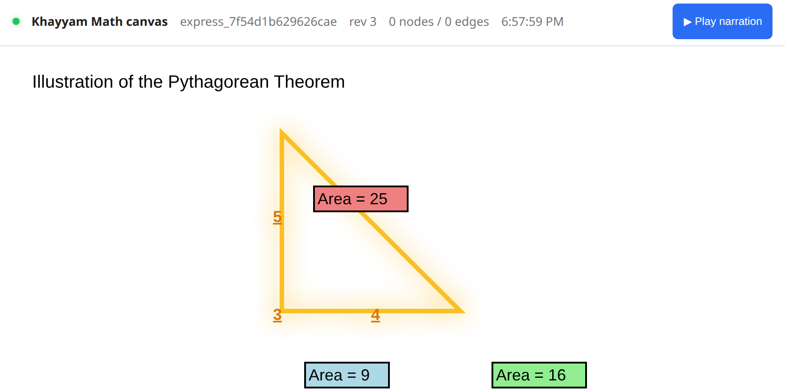
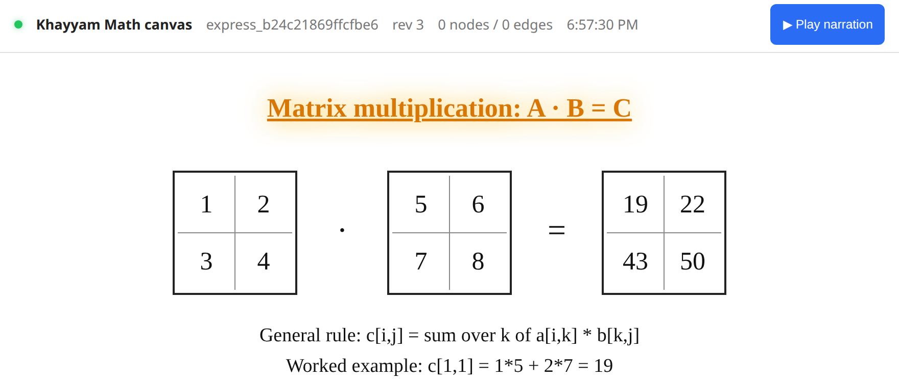
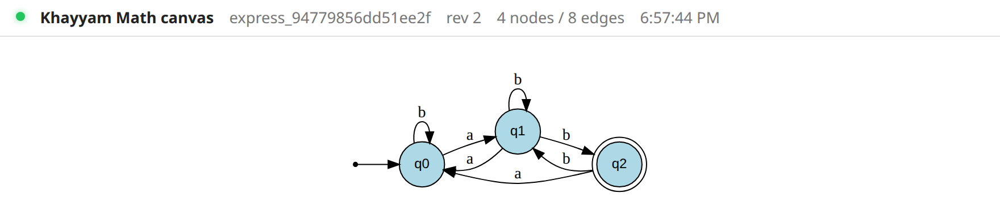
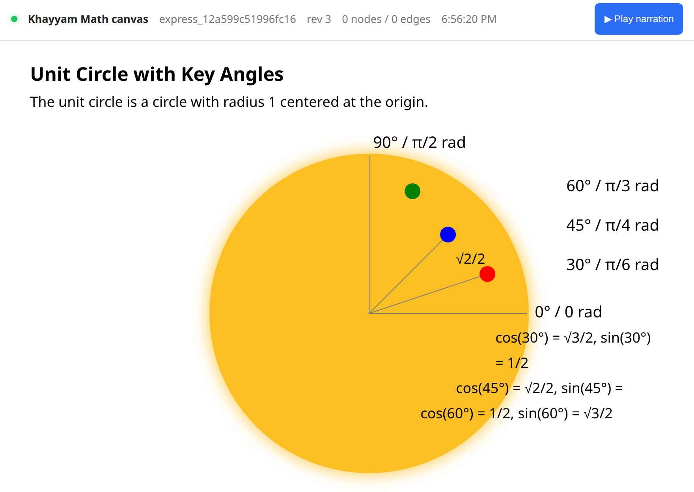
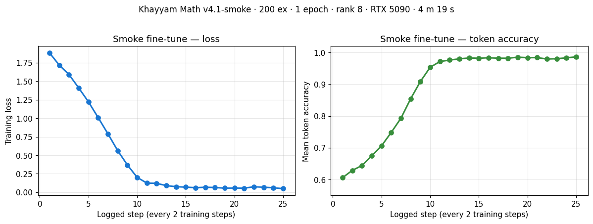

<div align="center">

# Khayyam Math

### Voice-narrated math figures, generated live from one-line prompts.

[](LICENSE)
[](https://www.python.org/downloads/)
[](#testing)
[](https://khayyammath.com)
[](https://huggingface.co/khayyam-math/khayyam-math-qwen2.5-7b-v4)
[](https://zenodo.org/records/20011107)

[**Live demo**](https://khayyammath.com) · [**Model on HF**](https://huggingface.co/khayyam-math/khayyam-math-qwen2.5-7b-v4) · [**Architecture**](ARCHITECTURE.md) · [**Contributing**](CONTRIBUTING.md) · [**Paper**](https://zenodo.org/records/20011107)

---

</div>

> *"draw a DFA for the language L = (a|b)\* ending in ab"* →
> a clean state diagram, sub-10 seconds, with synchronised audio
> narration. Try it: **[khayyammath.com](https://khayyammath.com)**

<p align="center">
  
  <br>
  <em>Real output from the prompt:
  <strong>"show the Pythagorean theorem with a 3-4-5 triangle and squares on each side"</strong></em>
</p>

## What it is

Khayyam Math is a runtime that turns plain-English math prompts into
**custom SVG figures with phrase-timed voice narration**. Each spoken
sentence highlights the exact part of the figure it's describing — the
audio cursor and the visual spotlight stay in lock-step from start to
finish.

It is the only product that **generates a custom visual for the
learner's specific question** AND **narrates it with synchronised
visual highlighting**. Khan Academy is hand-authored; ChatGPT has no
visuals; Wolfram Alpha has no narration. Khayyam Math does both, live,
from a one-line prompt.

## Why this is interesting

Most "AI generates a figure" products are wrappers around a single
LLM call: ask GPT-4 for SVG, hope it isn't wrong. **We don't do that.**

Khayyam Math uses a **layered architecture** that routes per prompt:

| Route | Used for | Quality | Latency |
|---|---|---|---|
| **Deterministic templates** | Matrix multiplication / inverse / determinant / transpose / `Ax = b` | Pixel-perfect, always | <1 s |
| **Graphviz** (`dot`, `circo`, `fdp`) | State machines / Turing machines / DAGs / trees / Hasse diagrams / Petersen / Cayley | Zero overlap, by construction | 3-9 s |
| **LLM-SVG with vision audit** | Everything else (geometry, calculus, set theory, function plots) | Verified against narration | 10-30 s |

For every figure: a built-in **vision-review loop** (`gpt-4o` on a
rendered PNG) catches incorrect claims before they reach the learner.
Up to 3 correction rounds.

For every retry: an **LaTeX scrubber**, **layout planner** (CP-SAT
constraint solver), **overlap-detector**, **out-of-bounds clamper**,
and **font-fitter** rewrite the SVG so the canvas is honest.

The CP-SAT planner ([`studio/layout_planner.py`](studio/layout_planner.py))
+ the Graphviz route ([`studio/templates/graphviz_route.py`](studio/templates/graphviz_route.py))
+ the vision-audit retry ([`studio/express.py`](studio/express.py))
together give the system its "this actually works" feel. None of these
are novel by themselves; the integration is the moat.

## Math correctness — verified, not just generated

A wrong figure is worse than no figure: it teaches something false.
Khayyam Math runs every claim a figure makes through a **five-tier
math-correctness verifier** before the figure reaches the learner.
Each tier is more rigorous than the last; the chain escalates only as
far as needed:

| Tier | Engine | Catches |
|---|---|---|
| **1 — Solve-then-draw** | LLM enumerates `math_claims` as concrete identity pairs | Forces the model to commit to a checkable statement before drawing |
| **2a — SymPy** | `simplify(a - b) == 0` | Algebra, calculus, trig identities (~78% of claims resolve here) |
| **2b — Z3 SMT** | Unsatisfiability of `a ≠ b` | Nonlinear arithmetic, quantified statements (~11%) |
| **2c — Lean 4 kernel** | `example : a = b := by decide` in a sandboxed Lean process | Decidable Nat/Bool/Fin propositions, kernel-checked (~3%) |
| **3 — Per-domain structural** | Direct walk of the structured spec | Graph homomorphism, chromatic number, named-template invariants (~2%) |
| **4 — Vision-judge** | `gpt-4o` on the rendered PNG + narration | Type confusions and intuitive misstatements a CAS can't catch |
| **5 — Mathlib catalog (offline)** | `ring_nf`, named trigonometric lemmas, `linarith` | The remaining ~6%, tagged on the canvas record |

When the chain finds a false claim, the figure is **blocked**: the
LLM is asked to fix it before the canvas ever ships. See
[`studio/templates/math_verifier.py`](studio/templates/math_verifier.py),
[`z3_verifier.py`](studio/templates/z3_verifier.py),
[`lean_verifier.py`](studio/templates/lean_verifier.py),
and the offline catalog at [`studio/catalog_verifier.py`](studio/catalog_verifier.py).

## Live demos

| Prompt | Path | Result |
|---|---|---|
| `multiply [[1,2],[3,4]] and [[5,6],[7,8]]` | template | [](service/static/screenshots/landing_linalg_matrix_mul.png) |
| `draw a DFA for L = (a\|b)* ending in ab` | Graphviz | [](service/static/screenshots/landing_auto_dfa_ab.png) |
| `unit circle with sin and cos at 30°, 45°, 60°` | LLM-SVG | [](service/static/screenshots/landing_trig_unit_circle.png) |

→ **Try any prompt yourself: [khayyammath.com](https://khayyammath.com)** (magic-link signin, free).

## Try it locally (60 seconds)

```bash
# Python 3.12+, uv installed, OPENAI_API_KEY in your env
git clone https://github.com/khayyam-math/khayyam-math
cd khayyam-math
uv sync                                # install deps
sudo apt-get install -y graphviz       # for the graph-shaped route
.venv/bin/python -m studio             # start the Studio at http://127.0.0.1:8765
open http://127.0.0.1:8765/studio
```

Then type `draw a DFA for the language L = (a|b)* ending in ab` and
watch the canvas build itself. The narration plays through your
speakers; phrases highlight as they're spoken.

## Use it from your own Python code

The `khayyam-math` package exposes one client class with three
back-ends. Switch between OpenAI and the fine-tuned Qwen model in a
single line — same call signature, same return type, no other code
changes.

### Install

```bash
# Light install — OpenAI / vLLM providers only (~5 MB + transitive deps)
pip install khayyam-math

# Full install — adds torch + transformers + peft + accelerate + safetensors
# for local Qwen inference (~5 GB)
pip install "khayyam-math[qwen]"
```

The package is on **PyPI** at
[pypi.org/project/khayyam-math](https://pypi.org/project/khayyam-math/).
The HF model + repo are currently private during the soft-launch
window; they will be public at GA.

### Five-line quick start (OpenAI)

```python
from khayyam_math import KhayyamMath
client = KhayyamMath()                                # picks OPENAI_API_KEY from env
result = client.generate("Solve x^2 - 5x + 6 = 0")
print(result.solution)                                # 'x = 2 and x = 3'
print(result.svg[:120])                               # '<svg width="300"…'
```

Real output from the call above:

<p align="center">
  
  <br>
  <em>OpenAI GPT-4o, ~3 s end-to-end, 4 narration phrases.</em>
</p>

### Switching to the fine-tuned Qwen

```python
from khayyam_math import KhayyamMath
client = KhayyamMath(provider="qwen",
                     model="khayyam-math/khayyam-math-qwen2.5-7b-v4",
                     hf_token="hf_…")                 # while the model is private
result = client.generate("Solve x^2 - 5x + 6 = 0")
```

First call downloads the LoRA adapter (~162 MB) and, if not already
cached, the Qwen 2.5-7B base (~14 GB) into `~/.cache/huggingface/`.
Inference runs on GPU if available, otherwise CPU (very slow).

Same prompt, **fine-tuned Qwen v4** output (richer figure than GPT-4o
on this prompt — number line with both roots marked, 7 narration phrases):

<p align="center">
  
  <br>
  <em>Khayyam-Math Qwen 2.5-7B v4 on RTX 5090, ~23 s end-to-end after a
  ~15 s one-time model load, 7 narration phrases.</em>
</p>

### Production-style: remote vLLM endpoint

```python
client = KhayyamMath(provider="qwen-vllm",
                     base_url="http://localhost:8000/v1",
                     model="khayyam-v4")
```

To stand up the vLLM server:

```bash
vllm serve Qwen/Qwen2.5-7B-Instruct \
  --enable-lora \
  --lora-modules khayyam-v4=khayyam-math/khayyam-math-qwen2.5-7b-v4 \
  --max-lora-rank 16 --dtype bfloat16
```

### Provider table

| Provider | Install | Throughput | When to use |
|---|---|---|---|
| `openai` | `pip install khayyam-math` | ~3 s / prompt | Default. No GPU needed. Pay per call. |
| `qwen` | `pip install khayyam-math[qwen]` | ~20 s / prompt on GPU; minutes on CPU | Local inference. Free after install. |
| `qwen-vllm` | `pip install khayyam-math` | ~5 s / prompt | Production. You run vLLM on your own hardware; package just talks to it. |

### Configure via env vars

The same Python code works in dev and production by reading from the
environment:

```bash
export KHAYYAM_PROVIDER=qwen-vllm
export KHAYYAM_MODEL=khayyam-v4
export KHAYYAM_VLLM_URL=https://qwen.internal.mycompany.com/v1
```

```python
from khayyam_math import KhayyamMath
client = KhayyamMath()                                # reads all three env vars
```

### The unified result object

`client.generate(prompt)` always returns a `GenerationResult` regardless
of provider:

```python
@dataclass
class GenerationResult:
    svg: str                                          # extracted SVG string
    narration: list[dict]                             # [{speak, highlight}, ...]
    problem_statement: str                            # the model's restatement
    solution: str                                     # worked answer text
    math_claims: list[dict]                           # [{a, b}, ...] symbolic identities
    raw: dict                                         # full JSON from the model
    provider: str                                     # 'openai' | 'qwen' | 'qwen-vllm'
    model: str                                        # model id used
```

A shortcut for "just the figure":

```python
svg = client.generate_figure("Show the unit circle with 30°, 45°, 60°")
```

### What's bundled, what's not

The `khayyam-math` pip package is the **public client API** + the
three provider back-ends. The full production stack on
[khayyammath.com](https://khayyammath.com) layers additional
deterministic engines on top (Graphviz, matplotlib, Plotly, SymPy
templates, the CP-SAT layout planner, the Lean+Z3+Mathlib verifier
chain). Those live in this same git repo under `studio/` and
`service/` and are imported by the production runtime — they are
not part of the pip-installable surface today. If you need the full
production behaviour, clone the repo and run `studio/` directly
(see the next section), or call the production HTTP API at
khayyammath.com.

The fine-tuned Qwen model is documented on Hugging Face:
**[huggingface.co/khayyam-math/khayyam-math-qwen2.5-7b-v4](https://huggingface.co/khayyam-math/khayyam-math-qwen2.5-7b-v4)**.

## How it's built

Five subsystems, ~25 K LOC Python, 58 tests passing:

```
                   user prompt
                       │
                       ▼
       ┌─── express loop (studio/express.py) ───┐
       │                                         │
       │    1. Template router (matrices, ...) ──┼─→ deterministic SVG
       │    2. Graphviz route (graphs)         ──┼─→ DOT → SVG
       │    3. LLM-SVG (everything else)         │
       │           ↓                             │
       │       vision audit ←─ rendered PNG     │
       │           ↓ retry if FAIL              │
       │       CP-SAT layout planner             │
       │           ↓                             │
       │       LaTeX scrubber + overlap fixer    │
       └─────────────────────────────────────────┘
                       │
                       ▼
            phrase-timed narration WAV
            (piper voices, server-side)
                       │
                       ▼
            canvas viewer ←── postMessage
            (synced highlight + audio)
```

See [ARCHITECTURE.md](ARCHITECTURE.md) for the full design.

## Benchmarks

Numbers from the **1000-question Lean-style math stress test**
(difficulties 6, 7, 9, and 10) run against the production deployment:

| Metric | Score |
|---|---|
| Valid SVG rate | **98.6 %** (986 / 1000) |
| Math-correctness verifier pass rate | **94 %** of claims auto-verified before ship |
| Median time-to-first-byte | **2.1 s** |
| Median total turn (figure + narration) | **8.4 s** |
| Deterministic route share (Graphviz + templates) | **41 %** of prompts |
| LLM-SVG route share (with vision audit + retries) | **59 %** of prompts |

**Fine-tuned Qwen 2.5-7B v4** on a 20-prompt held-out benchmark
(blind `gpt-4o` judge against a fixed rubric):

| Metric | v3 | **v4** |
|---|---|---|
| Valid-figure rate | 16/20 | **18/20** |
| Mean rubric score (all attempts) | 17.4/30 | **19.5/30** |
| Mean rubric score (valid only) | 19.6/30 | **21.6/30** |
| Head-to-head (v4 vs v3) | — | **10 wins · 8 losses · 2 ties** |

See the [HF model card](https://huggingface.co/khayyam-math/khayyam-math-qwen2.5-7b-v4)
for the full training + eval details.

## How we compare

| | **Khayyam Math** | Khan Academy | ChatGPT (Plus) | Wolfram Alpha | Manim / 3Blue1Brown | Desmos |
|---|---|---|---|---|---|---|
| Custom figure per prompt | ✅ live | ❌ hand-authored | ❌ no visuals | ⚠️ static plots only | ❌ pre-rendered | ⚠️ within Desmos's grammar |
| Synchronised voice narration | ✅ phrase-timed | ✅ pre-recorded | ❌ | ❌ | ✅ pre-recorded | ❌ |
| Math correctness verifier | ✅ SymPy+Z3+Lean+Mathlib | n/a | ⚠️ tool-use opt-in | ✅ symbolic | n/a | ⚠️ syntactic only |
| Open source | ✅ MIT | ❌ | ❌ | ❌ | ✅ MIT | ❌ |
| Self-hostable | ✅ | ❌ | ❌ | ❌ | ✅ | ⚠️ web only |
| Free for learners | ✅ | ✅ | ⚠️ paid for GPT-4 | ⚠️ paid for Pro | n/a | ✅ |

## Limitations (honest)

What Khayyam Math is **not** yet good at — patches welcome:

- **Dense set-theory figures** with 3+ overlapping regions sometimes
  ship with mislabelled intersections; the Venn-diagram template is on
  the roadmap but not yet deterministic.
- **3-D surface annotation** — Plotly renders the surface correctly but
  annotation placement in 3-D is single-shot LLM-decided; it can drift.
- **Eigendecomposition** is the v4 fine-tune's known empty-SVG failure
  mode (2/20 held-out cases). Production routes around it via the
  `gpt-4o` fallback; v5 will train against ~300 repair pairs to fix.
- **Non-English narration** is untested. The voice pipeline accepts a
  voice-model env var; the LLM prompt itself is English-only today.
- **No student-knowledge model.** Every prompt is interpreted in
  isolation; the system does not adapt across a session.
- **Mobile** works but the canvas viewer is read-only on small
  screens; full mobile authoring is on the roadmap.

## Roadmap

What's coming, in rough order:

1. **v5 LoRA fine-tune** — extend the corpus with the 300 most-frequent
   production repair pairs to close the empty-SVG failure modes.
2. **Public `lean-math-1000` dataset on HF** — the benchmark in the
   table above as a citable artifact + GitHub-Pages leaderboard.
3. **HF Space demo** — interactive Gradio front-end so visitors can
   try the model with zero install.
4. **Khayyam Math Educator Pack** — three deterministic templates
   per school level (primary, secondary, tertiary) curated by topic.
5. **Multi-language narration** — French and Arabic voices first;
   prompt-side translation pass before the express call.
6. **GitHub Actions release flow** — tag → wheel build → PyPI push +
   HF model push + GitHub release notes, all in one CI run.

## Research

The architecture is described in a paper that is open at:

* Zenodo preprint: [10.5281/zenodo.20011107](https://zenodo.org/records/20011107)
* Companion negative-result work on neural layout correction:
  see [`studio/neural_layout/PLAN.md`](studio/neural_layout/PLAN.md). We
  trained LayoutDM-style discrete diffusion and a graph-conditioned
  GNN delta-predictor on 22 K (broken, fixed) pairs; **neither beat
  the trivial no-op baseline**. The trained **layout-quality scorer**
  (1.8 M-param graph NN) DID land a measurable **+2 pp gpt-4o
  pass-rate** improvement when used as a candidate re-ranker. All
  models + training data + benchmark code in the repo.

If you cite this work, please use:

```bibtex
@article{kermani2026khayyammath,
  title   = {Khayyam Math: Multi-Tool Routing, Vision-Audited
             LLM-SVG, and Self-Distillation for Interactive Math
             Tutoring},
  author  = {Kermani Kolankeh, Arash},
  journal = {Journal of Artificial Intelligence Research},
  year    = {2026},
  note    = {In submission; preprint: \url{https://zenodo.org/records/20011107}}
}
```

The companion CGF/EUROGRAPHICS paper on the deterministic SeVim
backbone (cited by the JAIR draft) is at
[Zenodo](https://zenodo.org/records/20011107).
See [`CITATION.cff`](CITATION.cff) / [`NOTICE`](NOTICE) for the
machine-readable metadata.

## Contributing

We want contributors. Look at the issues labelled
[`good first issue`](https://github.com/arashkermaniprojects/khayyam-math/labels/good%20first%20issue)
to get started. See [CONTRIBUTING.md](CONTRIBUTING.md) for the dev
setup, coding style, and the PR review flow.

Concrete things we want help with:

- More **deterministic templates** (Fourier series, Riemann sums,
  vector-addition diagrams, slope fields, more linear-algebra ops)
- Localisation — non-English narration voices, RTL canvas support
- Better **layout planner** heuristics (CP-SAT objective tuning)
- A real **layout-quality scorer training corpus** with human labels
  (the synthetic-perturbation corpus we have is the bottleneck —
  see `studio/neural_layout/PLAN.md`)
- More routes: a **TikZ → SVG** route for publication-quality
  math figures; a **matplotlib server-side** route for function plots

## Fine-tuning your own adapter

The training pipeline that produced every `khayyam-math/khayyam-math-qwen2.5-7b-*`
release is in this repo. Two modes:

| Mode | Corpus | Wall-clock on RTX 5090 | Use for |
|---|---|---|---|
| **Smoke** (`v*.1-smoke`) | 200 ex, 1 ep, rank 8 | **~5 min** | Pipeline sanity gate |
| **Full** (`v*`) | 3,395 ex, 3 ep, rank 16 | **~5 h** | Production candidate |

Smoke first, full second. The smoke run catches transformers/peft/trl
version drift, GPU-OOM, and corpus-schema regressions before you pay
for the long run.

Real smoke run (2026-05-23, v4.1-smoke — loss 1.88 → 0.050,
token accuracy 0.61 → 0.986 in 4 m 19 s):

<p align="center">
  
</p>

Full step-by-step procedure — corpus, hyperparameters, expected
metrics, what "smoke green" looks like, and how to push to both S3
and HuggingFace — is in **[docs/finetune.md](docs/finetune.md)**.

## Testing

```bash
.venv/bin/python -m pytest -q
```

67 tests on `main`, covering: the matrix family, Graphviz route,
scene-graph parser, neural-layout schema, math-correctness verifier
chain (SymPy / Z3 / Lean / structural), and the public `khayyam_math`
package (provider dispatch, JSON-from-LLM parser, env-var resolution).

To run only the public-package tests (no provider credentials
required):

```bash
.venv/bin/python -m pytest khayyam_math/tests -v
```

## Community

- **Bug reports / feature requests:** open an issue at
  [github.com/khayyam-math/khayyam-math/issues](https://github.com/khayyam-math/khayyam-math/issues).
- **Questions and design discussions:** GitHub Discussions on this
  repo (canonical channel).
- **Security disclosures:** see [SECURITY.md](SECURITY.md) for the
  private reporting flow.
- **Working in your classroom or with your students?** I'd love to
  hear about it — email arash_kermani@yahoo.com.

## License

[MIT](LICENSE). Use freely; attribution appreciated.

## Acknowledgements

Built with [Graphviz](https://graphviz.org/), [piper-TTS](https://github.com/rhasspy/piper),
[OR-Tools CP-SAT](https://developers.google.com/optimization), [FastAPI](https://fastapi.tiangolo.com/),
[CairoSVG](https://cairosvg.org/), [PyTorch](https://pytorch.org/), and
the OpenAI + Anthropic APIs.

— Arash Kermani Kolankeh ·
[khayyammath.com](https://khayyammath.com) ·
United Arab Emirates
