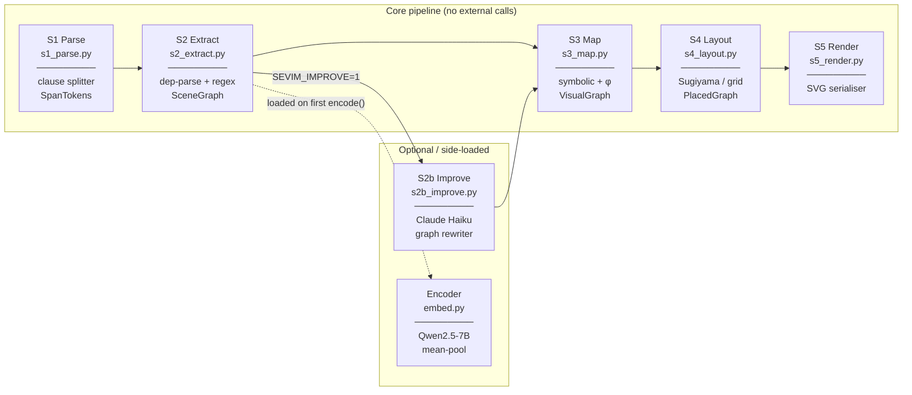

# SeVim — Semantic Visual Mapper

> ⚠️ **If you use this software, the pipeline design, the relation
> grammar, or any of the artefacts in your research, you MUST cite
> the SeVim paper** (see the [Citation](#citation) section below and
> the [`NOTICE`](NOTICE) file at the repository root).

> **Deterministic, real-time, byte-reproducible SVG diagrams from natural language.**
> No image model, no autoregressive sampling, no external API calls on the
> default path. The output is a pure function of the input and a frozen
> parameter set.

```
"Decision trees partition the feature space recursively."

      ┌──────────────────┐       causes      ┌──────────────────┐
      │  decision tree   │ ────────────────▶ │ feature space    │
      └──────────────────┘                   │ partitioning     │
                                             └──────────────────┘
```

---

## What this is

SeVim is the reference implementation accompanying the paper
*“SeVim: Deterministic Semantic-to-Visual Mapping for Real-Time Diagram
Generation via Hybrid Neuro-Symbolic Reasoning.”* The pipeline is built
around four invariants that hold *by construction*, not by approximation:

1. **Determinism.** Identical input → byte-identical SVG.
2. **Real-time incrementality.** Per-clause $p_{95} < 50$\,ms.
3. **Bidirectional provenance.** Every SVG element back-traces to a
   source word span; every input span maps to a graph element.
4. **Closed visual grammar.** A fixed primitive vocabulary (rect,
   ellipse, diamond, hexagon, parallelogram + line, arrow, text,
   group); no `<image>` or `<canvas>` ever emitted.

A re-runnable journal-grade evaluation harness is shipped under
[`bench/eval/`](bench/eval/) — extraction accuracy on a 60-clause gold
set, byte-determinism vs.\ a raw-LLM SVG baseline, wall-clock latency,
and an LLM-as-judge rubric (Claude Sonnet 4.6, blinded A/B,
fixed `rubric.txt`).

---

## Pipeline overview



| Module | Stage | Input → Output | Key algorithm |
|---|---|---|---|
| `s1_parse.py` | S1 | `str` → `[SpanToken]` | regex clause splitter |
| `s2_extract.py` | S2 | `[SpanToken]` → `SceneGraph` | dep-parse + regex cascade |
| `s2b_improve.py` | S2b *(opt)* | `SceneGraph` → `SceneGraph` | Claude Haiku API |
| `s3_map.py` | S3 | `SceneGraph` → `VisualGraph` | symbolic + frozen-W projection |
| `s4_layout.py` | S4 | `VisualGraph` → `PlacedGraph` | Sugiyama layered layout |
| `s5_render.py` | S5 | `PlacedGraph` → `str` (SVG) | SVG serialisation |
| `embed.py` | — | `str` → `tuple[float,…]` | Qwen2.5-7B mean-pool |
| `ir.py` | — | data model | dataclasses |
| `overlap.py` | S4.5 | `PlacedGraph` → findings | geometry checker |
| `pipeline.py` | — | orchestrator | `run_pipeline()` |
| `cli.py` | — | CLI entry point | argparse |
| `math_lex.py`, `math_graph*.py`, `equation.py`, `strict_layout.py` | — | math extension | LaTeX/matrix lexer, KaTeX inner labels, strict non-overlap pass |

---

## Installation

**Requires Python 3.10+.**

```bash
# 1. Clone
git clone https://github.com/arashkermaniprojects/sevim.git
cd sevim

# 2. Install the base package (no ML dependencies)
pip install -e .

# 3. (Optional) Install spaCy for the dependency-parse extraction path
pip install spacy
python -m spacy download en_core_web_sm

# 4. (Optional) Install the Qwen encoder for richer node geometry
pip install -e ".[embed]"   # adds torch + transformers
```

The base install runs the full pipeline without spaCy or Qwen: the
regex cascade handles extraction and all embeddings are empty (shapes
fall back to salience-only sizing).

---

## Quick start — CLI

```bash
echo "Gradient descent minimises the loss function by updating weights." > input.txt
sevim input.txt

# Outputs:
#   out.svg          — the diagram
#   out.ir.json      — scene graph (nodes, edges, revision counter)
#   out.trace.json   — per-stage diagnostic trace
```

Custom output prefix:

```bash
sevim input.txt --out diagrams/gradient_descent
```

Read from stdin:

```bash
cat input.txt | sevim -
```

---

## Quick start — Python API

```python
from sevim.pipeline import run_pipeline

result = run_pipeline("Backpropagation computes gradients using the chain rule.")

print(result.svg)           # SVG string (deterministic)
print(result.graph.nodes)   # list[SceneNode]
print(result.graph.edges)   # list[SceneEdge]
print(result.trace)         # list[TraceEvent], one per stage
```

### Multi-turn / streaming

Pass the previous result's graph to extend the diagram across turns:

```python
r1 = run_pipeline("A neural network contains layers.", utterance_id="u0")
r2 = run_pipeline("Each layer applies a linear transform.", utterance_id="u1", graph=r1.graph)
# r2.svg shows both sentences merged into one diagram
```

---

## Environment variables

| Variable | Default | Effect |
|---|---|---|
| `SEVIM_DISABLE_EMBED` | *(unset)* | Set to `1` to skip Qwen entirely (faster, no torch required) |
| `SEVIM_EMBED_MODEL` | `Qwen/Qwen2.5-7B` | HuggingFace model ID for the encoder |
| `SEVIM_EMBED_MAX_TOKENS` | `128` | Token truncation limit for the encoder |
| `SEVIM_IMPROVE` | *(unset)* | Set to `1` to enable Claude Haiku graph rewriting (S2b) — **breaks I1** |
| `ANTHROPIC_API_KEY` | *(unset)* | Required when `SEVIM_IMPROVE=1` or when running the eval harness |
| `SEVIM_STRICT_OVERLAPS` | *(unset)* | Set to `1` to raise `OverlapError` instead of logging |
| `SEVIM_STRICT_LAYOUT` | *(unset)* | Set to `1` to enable the provable-non-overlap S4.6 post-pass |
| `SEVIM_STRICT_DET` | *(unset)* | Set to `1` to pin single-threaded CPU ops (reproducibility) |
| `SEVIM_CANVAS_W` | `700` | Canvas width in SVG user units |
| `SEVIM_CANVAS_H` | `440` | Canvas height in SVG user units |

---

## Relation types

The 12 base concept-diagram relations (closed vocabulary):

| Relation | Visual encoding | Typical meaning |
|---|---|---|
| `causes` | directed arrow | A produces / leads to B |
| `used_for` | dashed arrow | A is a tool or technique for B |
| `requires` | hollow-triangle arrow | A needs B as a prerequisite |
| `reduces_to` | filled triangle (funnel) | A simplifies / specialises to B |
| `measures` | dotted line + `=` label | A quantifies B |
| `contains` | container nesting | A holds B as a member |
| `part_of` | container nesting | A is a component of B |
| `instance_of` | dashed arrow (up) | A is an example of B |
| `similar_to` | double parallel line + `≈` | A and B are analogous |
| `opposes` | bar–bar line | A and B are in contrast |
| `attribute_of` | smaller adjacent ellipse | A is a property of B |
| `sequence` | horizontal strip | A comes before B in order |

The math extension (see paper §9) adds 22 further relations
(`lies_on`, `perpendicular`, `parallel`, `equals`, `congruent`,
`element_of`, `subset_of`, `maps_to`, …) and 21 further primitives
(`point`, `segment`, `polygon`, `set_blob`, `equation_block`,
`matrix_bracket`, …) — strictly additive: every existing test stays
green and every existing SVG is byte-identical.

---

## Shape grammar

| Primitive | When used |
|---|---|
| `rect` | Default concept node |
| `ellipse` | Attribute / property node |
| `diamond` | Numeric parameter (weight, loss, …) |
| `hexagon` | Neural-network architecture (CNN, RNN, …) |
| `parallelogram` | Layer / transform / projection |

---

## Running tests and the evaluation harness

```bash
# Unit + integration tests
pytest tests/

# Journal-grade cross-system evaluation harness
python bench/eval/m1_extraction.py    # per-relation extraction P/R/F1 (60-clause gold set)
python bench/eval/m2_determinism.py   # byte-determinism vs raw-LLM SVG (Claude Haiku)
python bench/eval/m4_judge.py         # LLM-as-judge (Claude Sonnet 4.6, fixed rubric)
python bench/eval/tables.py           # regenerate LaTeX fragments from results/*.json
```

The harness records every API call to
`bench/eval/results/cost_ledger.json` with a hard cap of USD 20 (soft
target USD 1; the run that produced the paper figures cost USD 1.01).
The judge prompt is pinned verbatim in `bench/eval/rubric.txt`; the
gold-set is in `bench/eval/gold_clauses.json`. No metric in the paper
is hand-computed.

---

## Optional: S2b LLM graph improvement

When `SEVIM_IMPROVE=1` and `ANTHROPIC_API_KEY` are set, the pipeline calls
**Claude Haiku** (`claude-haiku-4-5-20251001`) after S2 extraction to:

- Merge near-duplicate nodes
- Remove spurious edges
- Add missing obvious edges
- Clean verbose node labels

This breaks determinism (invariant I1) because the model is stochastic.
The trace log records pre- and post-improvement graph sizes.

```bash
export SEVIM_IMPROVE=1
export ANTHROPIC_API_KEY=sk-ant-...
sevim input.txt
```

---

## Citation

Use of this code or any derivative work **requires citing the
companion paper.** A preprint is openly archived at Zenodo:

- **Preprint:** <https://zenodo.org/records/20011107>

BibTeX:

```bibtex
@article{kermanikolankeh2026sevim,
  title   = {{SeVim}: Deterministic Semantic-to-Visual Mapping for
             Real-Time Diagram Generation via Hybrid Neuro-Symbolic
             Reasoning},
  author  = {Kermani Kolankeh, Arash and Zgheib, Rita},
  journal = {Zenodo (preprint)},
  year    = {2026},
  doi     = {10.5281/zenodo.20011107},
  url     = {https://zenodo.org/records/20011107}
}
```

A `CITATION.cff` is provided at the repository root so that GitHub's
*Cite this repository* button resolves to the same record.

---

## License

This repository is currently distributed under
**Creative Commons Attribution-NonCommercial 4.0 International
(CC BY-NC 4.0)** — see [`LICENSE`](LICENSE) for the full text.

Three things follow from that, and they are not optional:

1. **Non-commercial use only.** Commercial use, including evaluation
   inside a for-profit product or service, requires written permission
   from the corresponding author.
2. **Attribution is mandatory.** CC BY-NC §3(a) requires that you
   preserve the [`NOTICE`](NOTICE) file alongside [`LICENSE`](LICENSE)
   in any redistribution or derivative, and that you cite the SeVim
   paper using the BibTeX entry below (or the venue-specific entry
   that supersedes it after journal acceptance). The academic
   citation requirement is part of the licence, not a separate
   request.
3. **The citation requirement persists across relicensing.** If the
   licence is later relaxed (for example, to MIT or Apache-2.0 upon
   formal journal acceptance), the citation requirement carried by
   `NOTICE` remains in force for any copy that ships with `NOTICE`
   intact, and any successor licence text will explicitly preserve
   the same requirement.

In short: cite the paper, keep `NOTICE` next to `LICENSE`, and ask
before any commercial use.

---

## Contact

Corresponding author: Arash Kermani Kolankeh
(arash.kolankeh@cud.ac.ae)
School of Engineering, Applied Science, and Technology (SEAST),
Canadian University Dubai, Dubai, UAE.

Issues and pull requests are welcome via the GitHub repository once
the work is publicly released. Until then, please contact the
corresponding author with research questions or extension proposals.
