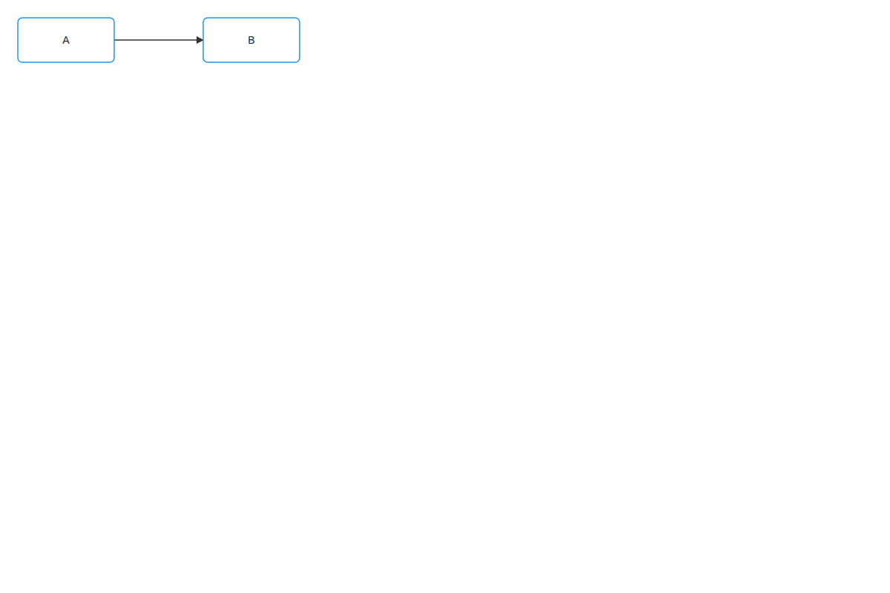
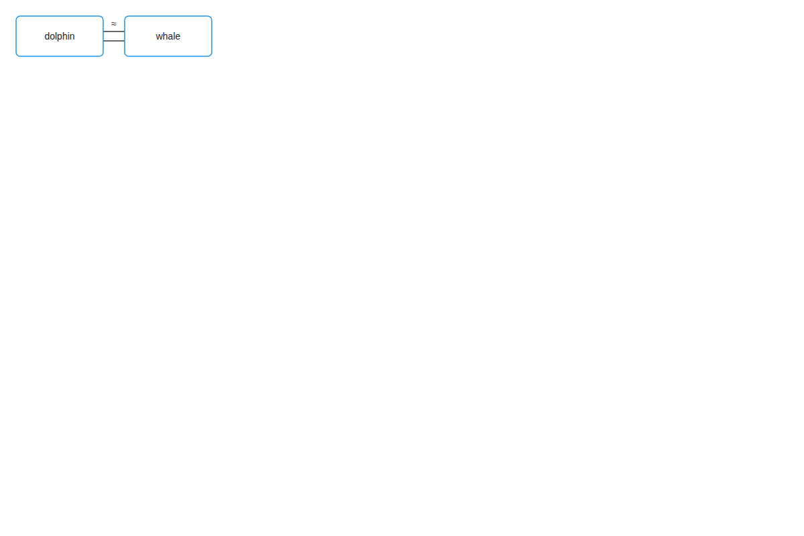
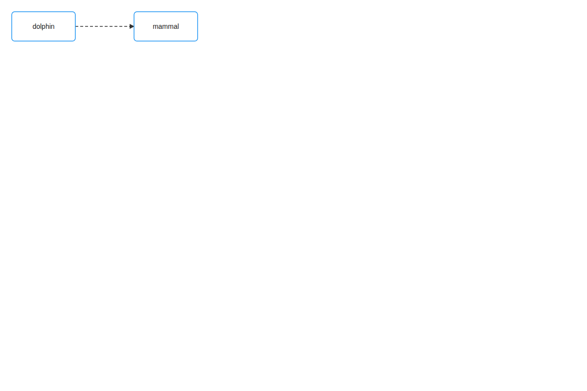
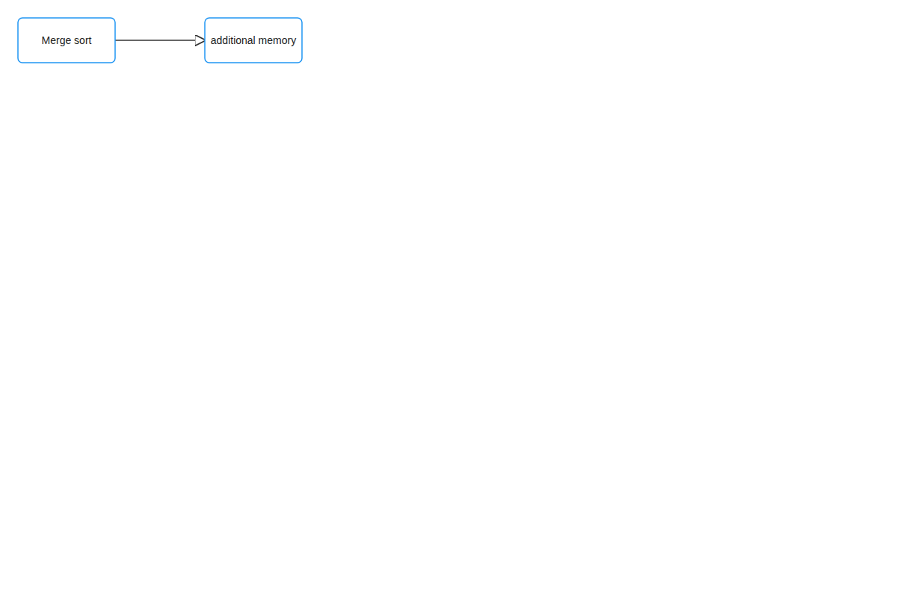
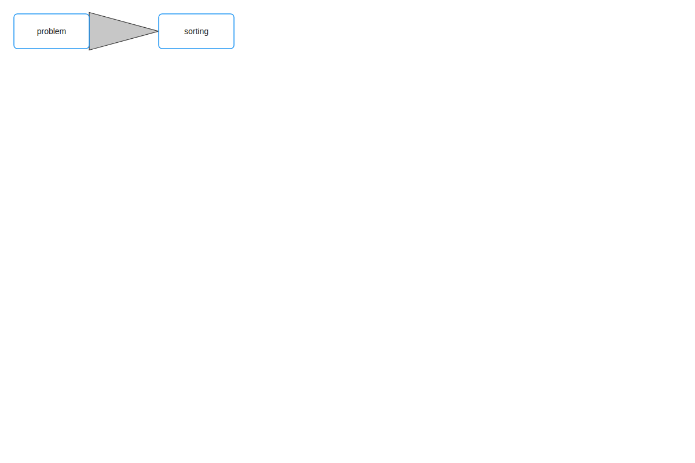

# Visual QA — Qwen2.5-VL verdicts per relation

Each row: relation, source sentence, Qwen-VL review covering (A) relation clarity and (B) overlap / occlusion.

## ✅ `causes`

*Source:* A causes B.

*Qwen-VL:* (A) The visual encoding uses a solid line with an arrow pointing from A to B, which intuitively suggests "causes" rather than another relation.

(B) There are no overlapping shapes, text that overlaps another text, or labels that are cut off in this diagram.

VERDICT: YES

## ✅ `sequence`

*Source:* Wake up then drink coffee.

*Qwen-VL:* (A) The visual encoding uses a simple line with an arrow, which effectively suggests a sequence from "Wake up" to "drink coffee." This intuitive representation aligns well with the concept of sequence.

(B) There are no overlapping shapes, text that overlaps another text, or labels that are cut off in this diagram.

VERDICT: YES

## ✅ `part_of`

*Source:* The arm is part of the body.

*Qwen-VL:* (A) The visual encoding uses a simple line connecting the two concepts, which intuitively suggests "part_of" rather than another relation.

(B) There are no overlapping shapes, text that overlaps another text, or labels that are cut off in this diagram.

VERDICT: YES

## ❌❌ `contains`

*Source:* The box contains a toy.

*Qwen-VL:* (A) The visual encoding uses a simple rectangular box with a smaller rectangle inside, which intuitively suggests "contains." However, the lack of an arrow or additional markers makes it less distinct compared to more conventional representations.

(B) There are no overlapping shapes, text that overlaps another text, or labels that are cut off in this diagram.

VERDICT: NO-BOTH

## ❌❌ `attribute_of`

*Source:* The body has a heart.

*Qwen-VL:* (A) The visual encoding uses a simple line connecting the two concepts, which is not distinctive but does suggest a direct relationship, possibly hinting at "attribute_of." However, it lacks the clarity needed to strongly imply this specific relation.

(B) There are no overlapping shapes, text that overlaps another text, or labels that are cut off in the image.

VERDICT: NO-BOTH

## ❌❌ `similar_to`

*Source:* A dolphin is similar to a whale.

*Qwen-VL:* (A) The visual encoding uses a simple line with an equals sign, which is not particularly distinctive but does suggest "similar_to" as it implies equality or closeness.

(B) There are no overlapping shapes, text, or labels that are cut off in this diagram.

VERDICT: NO-BOTH

## ✅ `opposes`

*Source:* Heat opposes cold.

*Qwen-VL:* (A) The visual encoding uses a thin line connecting the two boxes, which is simple but effective in suggesting opposition. The line's direction and proximity imply a direct relationship.

(B) There are no shapes or text that overlap or are obscured in this diagram.

VERDICT: YES

## ✅ `instance_of`

*Source:* A dolphin is an example of a mammal.

*Qwen-VL:* (A) The visual encoding uses a dashed line with an arrow, which is commonly used to indicate "instance_of," making the relationship intuitive.

(B) There are no overlapping shapes, text, or labels that are cut off in this diagram.

VERDICT: YES

## ✅ `used_for`

*Source:* The algorithm uses a binary heap.

*Qwen-VL:* (A) The visual encoding uses a dashed line with an arrow, which intuitively suggests "used_for" rather than another relation.

(B) There are no overlapping shapes, text that overlaps another text, or labels that are cut off in this diagram.

VERDICT: YES

## ✅ `requires`

*Source:* Merge sort requires additional memory.

*Qwen-VL:* (A) The visual encoding uses a line with an arrow, which intuitively suggests "requires" as it points from the concept needing additional memory to the concept providing it.

(B) There are no overlapping shapes, text that overlaps another text, or labels that are cut off in this diagram.

VERDICT: YES

## ✅ `reduces_to`

*Source:* The problem reduces to sorting.

*Qwen-VL:* (A) The visual encoding uses a gray arrow pointing from "problem" to "sorting," which intuitively suggests "reduces_to" rather than another relation.

(B) There are no overlapping shapes, text that overlaps another text, or labels that are cut off in this diagram.

VERDICT: YES

## ✅ `measures`

*Source:* The perimeter equals four times the side.

*Qwen-VL:* (A) The visual encoding uses a dashed line connecting the two boxes, which intuitively suggests "measures" rather than another relation.

(B) There are no overlapping shapes, text that overlaps another text, or labels that are cut off in this diagram.

VERDICT: YES

