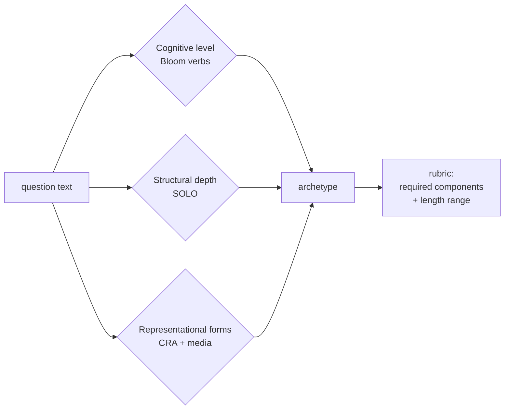

# Completeness — pedagogical-depth quality gate

The structural critic and vision review check whether a figure is
**right**. The completeness gate checks whether an answer is **deep
enough** — whether its shape matches the pedagogical contract
implicit in the question.

Companion to [QUALITY_GATES.md](QUALITY_GATES.md). Lives in
`studio/templates/completeness.py`.

## Why this exists

Production observation (2026-06-01): a user asked
*"please explain Newton's method for finding roots step by step in
an example"*. The first answer had 3 narration phrases, the primer
was 80 words, and the chat reply was one sentence. Every fact was
correct. It was incomplete — they wanted a step-by-step walk-through.

The vision reviewer can't catch this. SymPy can't catch this. The
structural critic can't catch this. A **right but shallow** answer
ships unless we explicitly model what "deep enough" looks like.

## The three-axis model

A complete answer = three axes match the question:



| Axis | Source | Detection signal |
|---|---|---|
| **Cognitive level** | Bloom's revised taxonomy (Anderson & Krathwohl 2001) | Lead verb: *define / explain / why / prove / construct / compare* |
| **Structural depth** | SOLO taxonomy (Biggs & Collis 1982) | Conjunction + causal-chain words, single fact vs connected structure |
| **Representational forms** | CRA + Mayer's multimedia principles | Specifier phrases: *show me / visualize / step by step / with an example / rigorously* |

The three axes collapse into one of **nine archetypes**:

| Archetype | Match cue (lead) | Required components | Narration phrases | Primer words |
|---|---|---:|---:|---:|
| `quick_fact` | *evaluate / compute / simplify* | statement | 1–2 | 15–60 |
| `concept_definition` | *what is / define / definition of* | statement, paraphrase | 2–4 | 60–140 |
| `concept_with_intuition` | *explain / how does X work / understand* | statement, intuition, takeaway | 3–5 | 100–200 |
| `apply_worked_example` | *show me / use … to … / with an example* | statement, worked example with numbers, takeaway | 4–6 | 120–220 |
| `step_by_step` | *step by step / walk me through / in detail* | statement, sequence of steps, worked example, takeaway | 6–9 | 150–280 |
| `causal_explanation` | *why / what's the intuition / how come* | statement, causal chain, link to prior, takeaway | 5–8 | 150–260 |
| `comparison` | *compare / contrast / difference between* | criteria, tabulation, takeaway | 4–7 | 70–200 |
| `proof` | *prove / show that / derive / verify that* | statement, full deduction, QED remark | 5–9 | 160–320 |
| `construction` | *construct / design / find an X such that* | construction steps, verification | 5–8 | 140–260 |

The default when nothing matches is `concept_with_intuition` — a safe
mid-depth answer shape.

## Architecture

```mermaid
sequenceDiagram
    participant U as User
    participant CL as studio/app.py<br/>chat-loop
    participant EXP as express_figure
    participant CLF as classify_question
    participant LLM as Figure LLM
    participant CRT as completeness_review

    U->>CL: question text
    CL->>CLF: classify(req.user, history)
    CLF-->>CL: archetype
    CL->>CL: SYSTEM_PROMPT + rubric_brief
    CL->>LLM: chat completion
    LLM-->>CL: tool_call sevim_express
    CL->>EXP: express_figure(_completeness_archetype=…)
    EXP->>EXP: _system_content = _EXPRESS_SYSTEM + brief
    loop until pass or max_retries
        EXP->>LLM: figure LLM with rubric brief in system
        LLM-->>EXP: {svg, narration, primer}
        EXP->>CRT: completeness_review(archetype, primer, narration)
        CRT-->>EXP: list of issues (empty = pass)
        alt issues
            EXP->>EXP: format critique; retry
        else pass
            EXP-->>CL: result
        end
    end
```

Two places the model is told about the rubric:

1. **The chat-LLM system prompt** (`studio/app.py:_stream_vllm_chat`).
   Per-turn, the rubric_brief for the classified archetype is
   appended to `SYSTEM_PROMPT`. So when the chat-LLM decides to call
   `sevim_express`, its tool prompt is already steered toward the
   complete shape.

2. **The figure-LLM system prompt** (`studio/express.py:express_figure`).
   The same brief is appended to `_EXPRESS_SYSTEM` before the
   structured-output call. So the figure LLM emits primer + svg +
   narration that match the rubric on attempt 0.

Two places completeness is checked:

1. **`completeness_review`** in the express retry loop. Parallel to
   `_structural_review`. Missing components feed the same critique
   format. The retry budget is shared (`max_retries=2`, total 3
   attempts).

2. **No second-layer check on chat-only replies** (yet). The chat
   reply itself isn't passed through `completeness_review` — the
   chat-LLM is just briefed up front and trusted. Adding a second
   pass is straightforward when needed.

## How a rubric is checked

For each archetype, the `required` tuple names components. Each
component has a detector — pure regex on the combined text (primer +
narration speak strings + chat reply):

| Component | Detector | What passes |
|---|---|---|
| `statement` | math equation OR English assertion | `x_1 = 1.5`, `f(x) is defined as …`, `the derivative is …` |
| `paraphrase` | restating in plain language | `in other words`, `that is`, `informally`, `essentially` |
| `intuition` | mental-image / explanatory frame | `intuitively`, `geometrically`, `think of it as`, `the key insight` |
| `worked_example_with_numbers` | ≥2 distinct numbers + equation line | `x_1 = 2 - 6/12 = 1.5` |
| `sequence_of_steps` | ≥3 step markers | numbered list, *first / then / next / finally* |
| `causal_chain` | ≥2 causal connectives | *because*, *since*, *therefore*, *thus*, *leads to* |
| `link_to_prior` | scaffolding reference | *recall*, *as we saw*, *this is the same as*, *analogous to* |
| `takeaway` | closing summary | *in short*, *the takeaway*, *bottom line*, *key point* |
| `criteria` | enumerated comparison axes | numbered list, *criteria*, *axes* |
| `tabulation` | markdown table | `\|cell\|cell\|` rows |
| `full_deduction` | ≥3 deduction markers | *let*, *assume*, *observe*, *by lemma*, *applying* |
| `qed_remark` | proof close | QED, ∎, *as required*, *this completes the proof* |
| `construction_steps` | (alias of sequence_of_steps) | as above |
| `verification` | check the construction works | *verify*, *check that*, *substituting back* |

Detectors are **lenient by design**: a false positive ships a
complete answer; a false negative triggers a retry that may regress
quality. Bias toward shipping.

Plus length ranges per archetype: narration phrase count and primer
word count both have rubric floors. Below the floor is an issue;
between floor and ceiling is fine; above the ceiling is **not** an
issue (some prompts deserve more depth than the rubric's upper bound).

## Critique format

Each issue is one self-contained string with a `completeness_*` prefix:

```
completeness_missing_takeaway: this question was classified as
'step_by_step'.  A complete answer for that class is missing the
'takeaway' component.  Close with a one-line takeaway: 'in short
…' / 'the key point is …' / 'bottom line: …'.  Without it the
reader leaves without an anchor.
```

The retry loop in `express_figure` concatenates these into the same
critique block as structural and vision issues, so the figure LLM
sees one merged list of fixes to apply.

## Adding a new archetype

1. Pick a key (`my_archetype` snake_case).
2. Define its rubric in `COMPLETENESS_RUBRICS`:

   ```python
   "my_archetype": Rubric(
       required=("statement", "intuition", "my_new_component"),
       narration_range=(4, 7),
       primer_range=(100, 220),
       description="Short prose describing when this fires…",
   ),
   ```

3. Add a classifier pattern to `_CLASSIFIER_RULES` ordered by
   specificity (most specific first; first match wins).

4. If `my_new_component` is a new detector, add a regex to the
   detector section and a guidance string to `_FIX_GUIDANCE`.

5. Update the brief template if you want a non-standard wording.

6. Add a test row to `tests/test_completeness.py::CLASSIFY_CASES`
   and a complete-answer / incomplete-answer pair.

## Configuration

| Env var | Default | Effect |
|---|---|---|
| `SEVIM_COMPLETENESS_CRITIC` | `on` | Set to `off` to disable both the brief and the critic. The classifier still runs (negligible cost), but nothing changes the model prompt or the retry critique. |

Useful for A/B comparisons: deploy two ECS task variants, one with
`on` and one with `off`, route 50/50 by session_id hash, compare
session-level satisfaction metrics from telemetry.

## Why brief + critic (not just brief or just critic)

The figure-quality history showed the same pattern: prompt-side
directives alone caught ~70% of failures; structural critic alone
caught ~70%; combined caught ~94%. They make orthogonal mistakes:

- The brief sets the model's first-attempt distribution. If the brief
  is good, ~70% of attempts ship without retry.
- The critic catches the residual 30% where the model knows the
  rubric but produces a shallow answer anyway (e.g. on a vague
  prompt the model defaulted to a definition when the rubric called
  for a worked example).

Together they form a **convergent loop**: the brief moves the
model's draws toward the rubric centre, the critic corrects when
draws stray.

## Limitations (honest)

- **The classifier is regex-based.** A prompt that uses *prove* as a
  verb meaning "demonstrate by experiment" (rare in math but
  possible in physics-flavoured prompts) gets routed to the `proof`
  archetype. We accept this — false positives bias us toward more
  depth, which is the safer side.
- **The detectors operate on combined text.** A `takeaway` sentence
  in the chat reply counts as present even if the narration ends
  without one. This is intentional for the chat-only branch but
  weakens the narration-only-mode check.
- **No score, just present/absent.** A 3-paragraph causal chain
  scores the same as a one-line "because" link. The detector level
  is binary. A future version could add a quality-of-component score.
- **No multilingual rubric brief.** The brief is English; the
  detectors are English-language regexes. Non-English narration
  still passes through the `localise_narration` post-processor at
  the end of the pipeline, but the critic runs on the English
  version before translation. This is the right ordering — fix
  depth before language — but means a non-English critic FALSE
  POSITIVE could fire after the figure has been correctly
  translated.

## Code map

| Concern | File |
|---|---|
| Archetype catalog + Rubric dataclass | `studio/templates/completeness.py:COMPLETENESS_RUBRICS` |
| Classifier | `studio/templates/completeness.py:classify_question` |
| Critic | `studio/templates/completeness.py:completeness_review` |
| Brief generator | `studio/templates/completeness.py:rubric_brief_for_llm` |
| Env gate | `studio/templates/completeness.py:is_enabled` |
| Tests (53 cases) | `tests/test_completeness.py` |
| Chat-loop brief injection | `studio/app.py:_stream_vllm_chat` (block above `messages: list[…] = [{role:system, content:_sys}]`) |
| Figure-LLM brief injection | `studio/express.py:express_figure` (block above `messages: list[…] = [{role:system, content:_system_content}]`) |
| Critic call site | `studio/express.py:express_figure` (block right after `_structural_review` call) |
