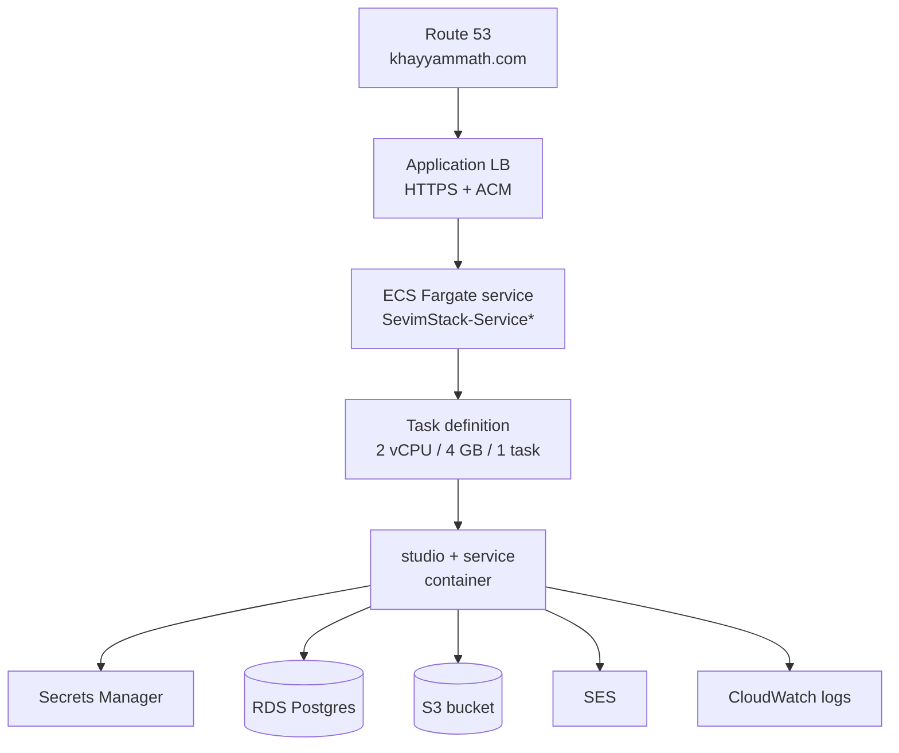
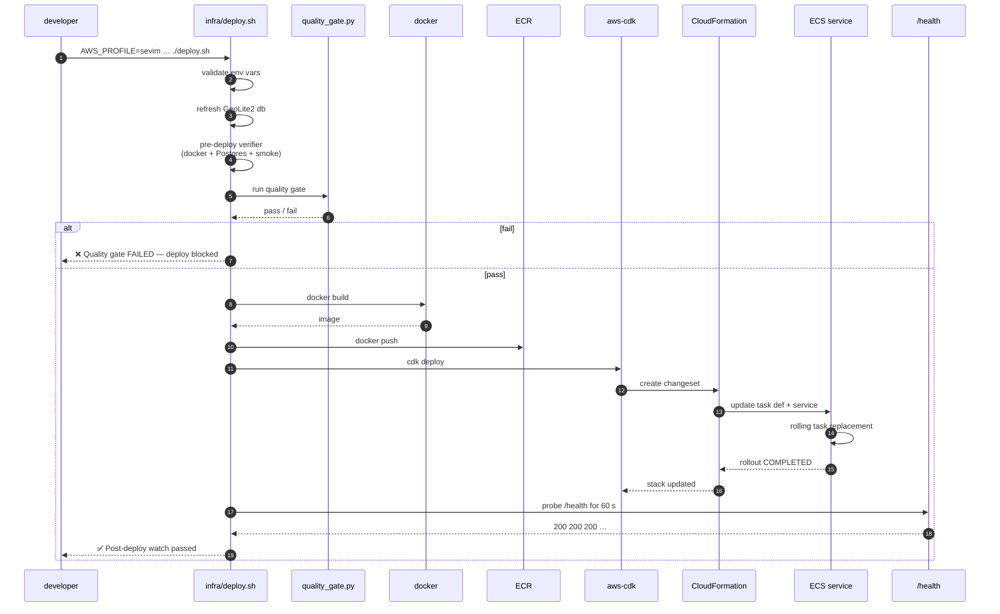

# Deploy runbook (AWS Fargate)

How Khayyam Math gets from `git push` to the live service at
[khayyammath.com](https://khayyammath.com).

## Topology



Account: **332504859695**. Region: **us-east-1**. Stack: **`SevimStack`**.

Secrets in Secrets Manager:

| Name | Used for |
|---|---|
| `sevim/openai` | OPENAI_API_KEY for figure + reviewer + primer LLMs |
| `sevim/auth_secret` | HMAC secret for magic-link cookies |
| `sevim/db_credentials` | RDS Postgres connection |
| `sevim/ses_from` | "From" address for magic-link emails |
| `sevim/ip_hash_salt` | Salt for IP-based rate limiting |

CloudWatch log group: `SevimStack-AppLogsC5DF83A6-67go79B0ttdt`
(the suffix is CDK-generated; resolve dynamically with
`aws logs describe-log-groups --query '…'`).

## The deploy wrapper

**Always run `infra/deploy.sh`**, never bare `cdk deploy`
(memory `feedback_deploy_wrapper`).

```bash
cd /home/ara/Documents/Programming/sevim_plugin/infra
AWS_PROFILE=sevim \
CDK_DEFAULT_ACCOUNT=332504859695 \
CDK_DEFAULT_REGION=us-east-1 \
SEVIM_DOMAIN=khayyammath.com \
./deploy.sh
```

Or under `sg docker` so docker has socket permissions:

```bash
sg docker -c 'cd /home/ara/Documents/Programming/sevim_plugin/infra && \
  AWS_PROFILE=sevim CDK_DEFAULT_ACCOUNT=332504859695 \
  CDK_DEFAULT_REGION=us-east-1 SEVIM_DOMAIN=khayyammath.com \
  ./deploy.sh 2>&1'
```

What the wrapper does that bare `cdk deploy` doesn't:

1. Exports `AWS_REGION` + `AWS_DEFAULT_REGION` matching
   `CDK_DEFAULT_REGION` (so the AWS SDK doesn't try to load
   bootstrap from the wrong region).
2. Records the previous task-def ARN for auto-rollback.
3. Refreshes the bundled GeoLite2-City.mmdb (used for telemetry).
4. Runs the pre-deploy verifier (docker + Postgres + endpoint
   smoke tests).
5. Runs the quality gate (50 automated criteria over a fixed
   prompt set). Failing this **blocks the deploy**.
6. Builds the Docker image, pushes to ECR.
7. Runs `cdk deploy`.
8. Post-deploy health watch — probes `https://khayyammath.com/health`
   for 60 s; 3 consecutive failures auto-rollback.

## The pipeline visualised



Typical wall-clock on a warm cache:

- Quality gate: ~60 s (3 prompts in FAST mode; ~5 min full)
- Docker build: ~30 s (cached layers) / ~5 min cold
- ECR push: ~15 s (layer dedup)
- CFN changeset + ECS rotation: ~3-4 min
- Total: **~5-8 min** end-to-end.

## Bypasses

| Variable | Effect |
|---|---|
| `SEVIM_SKIP_QUALITY_GATE=1` | Skip the pre-deploy quality gate (emergency hotfix only) |
| `SEVIM_QUALITY_GATE_FAST=1` | Run a 3-prompt subset of the gate (~60 s vs ~5 min) |
| `--no-execute` (cdk flag) | Create the changeset but don't execute it |

## Common failures + recovery

### 1. `Other CLIs (PID=…) are currently reading from cdk.out`

A prior `cdk deploy` is still running (or got orphaned by a
killed parent shell). Kill it:

```bash
pkill -9 -f "cdk deploy"
rm -f infra/cdk.out/.lock
```

Then re-run the wrapper. Note: even when `cdk` died, CFN may
have already applied the changeset — check task def revision
with:

```bash
AWS_PROFILE=sevim aws ecs describe-services --region us-east-1 \
  --cluster SevimStack-ClusterEB0386A7-v4AtWGHqxGkN \
  --services SevimStack-Service9571FDD8-VxcEhl318ICU \
  --query 'services[0].deployments[*].{status:status,taskDef:taskDefinition,rolloutState:rolloutState}'
```

If a fresh task def is the PRIMARY, ECS will keep rotating
without re-running CDK.

### 2. `Quality gate FAILED — TTFB < 8s — ttfb=15.04s`

Single-prompt perf flake. Usually transient (cold model on
the OpenAI endpoint). Re-run the deploy; if it fails twice in
a row, investigate the slow route in the gate output.

### 3. `cannot connect to docker daemon`

Docker isn't running or your user isn't in the `docker` group:

```bash
# start docker
sudo systemctl start docker
sudo systemctl enable docker

# add user to docker group (logout + login after this)
sudo usermod -aG docker $USER
```

Workaround for the current shell: prefix commands with
`sg docker -c '…'` (executes the inner command with the
docker group active).

### 4. `current credentials could not be used to assume … cdk-hnb659fds-…-role`

Run `aws sso login --profile sevim` (or `aws configure --profile
sevim` to re-enter long-term keys). The wrapper proceeds with a
warning when the role assume fails but the underlying creds are
for the right account.

### 5. `[deploy.sh] ❌ Quality gate FAILED` on a Newton template prompt

The newton template requires a SymPy-parseable `f` and a numeric
`x0`. If you renamed an arg or changed the parser, the gate
prompt for Newton will fail with `unparseable claims`. Run the
gate locally before committing:

```bash
SEVIM_QUALITY_GATE_FAST=1 python infra/quality_gate.py
```

### 6. Post-deploy `/health` returns 503

The ECS task is failing to start. Tail CloudWatch:

```bash
AWS_PROFILE=sevim aws logs tail \
  SevimStack-AppLogsC5DF83A6-67go79B0ttdt \
  --since 5m --follow --region us-east-1
```

The wrapper records the previous task-def ARN. Manual rollback:

```bash
AWS_PROFILE=sevim aws ecs update-service --region us-east-1 \
  --cluster SevimStack-ClusterEB0386A7-v4AtWGHqxGkN \
  --service SevimStack-Service9571FDD8-VxcEhl318ICU \
  --task-definition <previous-task-def-arn>
```

## Cycling the magic-link auth secret

```bash
# 1. Generate a new secret
NEW=$(openssl rand -hex 32)

# 2. Update Secrets Manager
AWS_PROFILE=sevim aws secretsmanager put-secret-value \
  --region us-east-1 --secret-id sevim/auth_secret \
  --secret-string "$NEW"

# 3. Force a new deploy so tasks pick up the new value
AWS_PROFILE=sevim aws ecs update-service --region us-east-1 \
  --cluster SevimStack-ClusterEB0386A7-v4AtWGHqxGkN \
  --service SevimStack-Service9571FDD8-VxcEhl318ICU \
  --force-new-deployment
```

Existing user cookies are now invalid — they'll get a magic-link
email on next visit.

## What happens to canvases across a deploy

ECS tasks are stateless: an in-memory canvas is gone after the
old task terminates. Persistence path:

1. `Canvas.set_raw_svg` + `Canvas.narrate` both call
   `Canvas._persist` → writes `<id>/state.json` to S3.
2. On the new task, `REGISTRY.get(prior_id)` cache-misses but
   calls `_try_rehydrate`, which reads `<id>/state.json` from S3
   and reconstructs the Canvas.
3. The conversation-awareness model (see
   [REFINEMENT.md](REFINEMENT.md)) depends on this — refinement
   after a deploy works because the prior canvas is still
   reachable.

So a deploy does NOT invalidate active conversations.

## Cost guard

`SEVIM_COST_GUARD=1` is on in production. Per-session cost limits
(set in `studio/sessions.py`):

- Default: $10 / session.
- Bypass for admin email (so the user testing in prod doesn't
  rate-limit themselves).
- Free for the demo account (whitelist).

Tracking: every `express_figure` records `cost_usd_estimate` in
RDS `turns` + `canvases` tables. Admin can see usage at
`/studio/admin/stats`.

## Smoke-testing in production with curl

Mint an auth cookie locally to drive the chat endpoint:

```bash
SECRET=$(AWS_PROFILE=sevim aws secretsmanager get-secret-value \
  --region us-east-1 --secret-id sevim/auth_secret \
  --query SecretString --output text)

COOKIE=$(python3 - "$SECRET" <<'EOF'
import sys, base64, hmac, hashlib, json, time
secret = sys.argv[1].encode()
payload = {"sub": "you@example.com", "exp": int(time.time()) + 7200}
body = json.dumps(payload, separators=(",", ":"), sort_keys=True).encode()
b64 = base64.urlsafe_b64encode(body).rstrip(b"=").decode("ascii")
sig = hmac.new(secret, b64.encode("ascii"), hashlib.sha256).digest()
sigb64 = base64.urlsafe_b64encode(sig).rstrip(b"=").decode("ascii")
print(f"{b64}.{sigb64}")
EOF
)

curl -sN -X POST https://khayyammath.com/studio/chat \
  -H "Cookie: sevim_auth=$COOKIE" \
  -H "content-type: application/json" \
  --data '{"history":[],"user":"draw a DFA for L=(a|b)* ending in ab","canvas_id":null,"prior_canvas_ids":[],"session_id":"smoke","flagged":false}' \
  --max-time 180
```

Add `--no-buffer` for line-by-line streaming.

## Re-running the gate against a deployed instance

```bash
SEVIM_REMOTE_BASE=https://khayyammath.com \
SEVIM_AUTH_COOKIE="$COOKIE" \
python infra/quality_gate.py
```

Useful for post-deploy verification or to verify a rollback
didn't break anything.

## Forgetting a deploy

The wrapper records the previous task def. To roll back:

```bash
# Pull the previous task-def ARN out of the wrapper's log
grep "Previous task def" <last-deploy-output>

# Then update the service
AWS_PROFILE=sevim aws ecs update-service --region us-east-1 \
  --cluster <cluster> --service <service> \
  --task-definition <previous-arn>

# Wait for the rollout to complete
AWS_PROFILE=sevim aws ecs wait services-stable --region us-east-1 \
  --cluster <cluster> --services <service>
```

If the issue is bad code rather than infrastructure, prefer
fixing the code and forward-deploying — rollback rotates ECS
twice (back to old, then later forward) and burns time.
