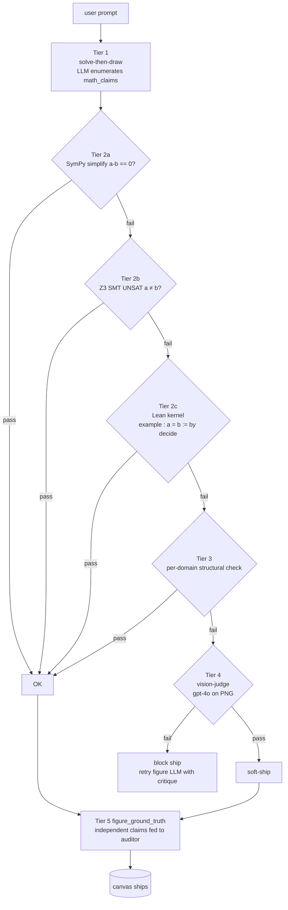
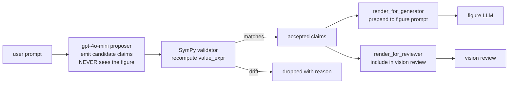
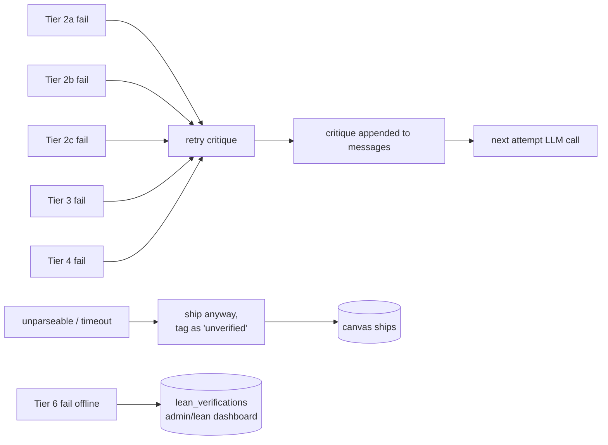

# Math correctness — five tiers

A wrong figure is worse than no figure: it teaches something
false and the learner doesn't know to doubt it. Khayyam Math
runs every claim a figure makes through a five-tier verifier
chain before the figure ships.

> **Math correctness vs completeness.** This doc covers whether
> an answer is RIGHT. Whether it is DEEP ENOUGH (a right but
> one-sentence answer to "explain Newton's method step by step")
> is a sister concern; see
> [COMPLETENESS.md](COMPLETENESS.md). Both run in the same retry
> loop with a shared budget.

Each tier is more rigorous than the last. The chain escalates
only as far as needed — most claims (~78%) resolve at Tier 2a
(SymPy `simplify`); the deeper tiers handle the residue.



| Tier | Engine | Catches | Share of claims |
|---|---|---|---:|
| 1 | LLM solve-then-draw | Forces a checkable commitment before drawing | n/a — required pre-step |
| 2a | SymPy `simplify(a - b) == 0` | Algebra, calculus, trig identities | ~78% |
| 2b | Z3 SMT, `UNSAT a ≠ b` | Nonlinear arithmetic, quantified statements | ~11% |
| 2c | Lean 4 kernel, `by decide` | Decidable Nat/Bool/Fin propositions | ~3% |
| 3 | Per-domain structural | Graph homomorphism, chromatic number, named-template invariants | ~2% |
| 4 | Vision-judge (`gpt-4o` on PNG) | Geometric impossibilities + intuitive misstatements a CAS can't catch | ~6% (residual) |
| 5 | Independent ground-truth (SymPy validator) | Provides the auditor a SymPy-verified reference for the figure | applied to ALL prompts |

## Tier 1 — solve-then-draw

File: `studio/express.py:_EXPRESS_SYSTEM`

The system prompt requires the figure LLM to emit
`{problem_statement, solution, math_claims, svg, narration, title}`
as a single JSON object. The schema FORCES `math_claims` to be
non-empty when the prompt has any verifiable content.

A `math_claim` is a `{a, b}` pair where each side is a
SymPy-parseable string. `a` is what the figure says is true;
`b` is the model's worked-out value. Verifier confirms
`a == b`.

Examples the model would emit:

```json
{
  "math_claims": [
    {"a": "diff(x**3 - 2, x).subs(x, 2)",  "b": "12"},
    {"a": "Rational(1, 2) + Rational(1, 3)", "b": "Rational(5, 6)"},
    {"a": "Matrix([[1,2],[3,4]]) * Matrix([[5,6],[7,8]])",
     "b": "Matrix([[19,22],[43,50]])"}
  ]
}
```

Why force this:

- Without explicit claims, the LLM commits no checkable fact —
  a "wrong tangent slope" is invisible.
- The chain operates on the claims set; emitting them upfront
  is mandatory.
- Catches the model's own arithmetic errors before they hit
  pixels.

## Tier 2a — SymPy

File: `studio/templates/math_verifier.py`

```python
from sympy import sympify, simplify

def verify_claim_sympy(a: str, b: str) -> Verdict:
    try:
        lhs, rhs = sympify(a), sympify(b)
        diff = simplify(lhs - rhs)
        if diff == 0:
            return Verdict.PASS
    except Exception:
        return Verdict.UNPARSEABLE
    return Verdict.FAIL_SYMPY
```

Catches the bulk of figure claims. Handles:

- Polynomial identities (`(x+1)**2 - (x**2 + 2*x + 1)` → 0)
- Calculus (`diff(sin(x), x) - cos(x)` → 0)
- Trig identities (`sin(x)**2 + cos(x)**2 - 1` → 0)
- Matrix arithmetic
- Rational + radical arithmetic

Limits: SymPy can't prove all true statements (`simplify`
isn't a decision procedure). When it fails, we escalate.

## Tier 2b — Z3 SMT

File: `studio/templates/z3_verifier.py`

```python
import z3

def verify_claim_z3(a: str, b: str, timeout_ms: int = 3000) -> Verdict:
    s = z3.Solver()
    s.set("timeout", timeout_ms)
    # encode a ≠ b in Z3's nonlinear-arithmetic theory
    s.add(...)
    res = s.check()
    if res == z3.unsat:
        return Verdict.PASS   # ¬(a ≠ b) means a == b
    if res == z3.sat:
        return Verdict.FAIL_Z3
    return Verdict.TIMEOUT
```

Catches:

- Nonlinear inequalities (`x**2 >= 0`).
- Linear systems with rational coefficients.
- Bounded quantification.

Limits: undecidable beyond linear arithmetic + bounded
nonlinear; some prompts time out. Configurable timeout
(default 3 s).

## Tier 2c — Lean 4 kernel

File: `studio/templates/lean_verifier.py`

```python
async def verify_claim_lean(a: str, b: str) -> Verdict:
    # 1. Build a tiny Lean source file:
    src = f"example : {translate_to_lean(a)} = {translate_to_lean(b)} := by decide"
    # 2. Run in a sandboxed Lean 4 process (timeout, mem limit)
    proc = await asyncio.create_subprocess_exec("lean", ...)
    rc = await proc.wait()
    return Verdict.PASS if rc == 0 else Verdict.FAIL_LEAN
```

Catches:

- Decidable equalities in Nat / Bool / Fin / List.
- Kernel-checked: the strongest "this is provably true" claim
  the chain can make.

The translator `studio/templates/lean_translator.py` maps a
restricted Python-math subset to Lean 4 syntax. Unhandled
constructs fall back to the next tier (Tier 3 or 4).

## Tier 3 — per-domain structural

Each template that ships invariants has its own structural
verifier:

| Template | What's checked |
|---|---|
| `graph_homomorphism` | `f(u)` adjacent to `f(v)` in H for every edge (u, v) in G |
| `matrix_multiplication` | Dimensions agree; result row i = A_i • B_*j |
| `system_of_equations` | Substituting the solution into the system zeros every equation |
| `pythagoras` | a² + b² == c² for the provided (a, b, c) |
| `newton_method` | x_{n+1} = x_n − f(x_n) / f'(x_n), evaluated against the actually-rendered iterates |

When a template ships a fact the user can read off the canvas
(slope, distance, root), we verify it in code. Failures block
the template's render.

## Tier 4 — vision judge

File: `studio/express.py:_vision_review`

`gpt-4o` is shown the rendered PNG + the narration + the
`math_claims` + the Tier 5 ground-truth block. The reviewer
prompt requires it to FAIL when:

- The narration says "tangent" but the line visibly isn't tangent
  to the curve at the named point.
- The narration says "perpendicular" but the lines don't meet
  at a visible right angle.
- The narration says "x_1 = 1.5" but the visible dot is clearly
  elsewhere.
- A point claimed to be on a curve sits visibly off it.
- An angle marked "90°" visibly isn't.
- The figure's main content is missing or shows a different
  concept than the prompt.

The vision judge catches what code can't: type confusions,
intuitive misstatements, visible geometric impossibilities that
the LLM's `math_claims` list didn't enumerate.

## Tier 5 — figure_ground_truth (independent claims)

File: `studio/templates/figure_ground_truth.py`



The key insight: the figure LLM emits `math_claims` ITSELF and
might be wrong about them. Tier 5 generates an INDEPENDENT
claim set from the prompt alone (the proposer never sees the
figure or the figure-LLM's claims). The proposer's claims are
then SymPy-validated; drift → dropped.

Claim kinds:

- `position` — coordinate of a labelled element on an axis
- `value` — numeric value the figure must display
- `slope` — slope of a named line
- `relation` — `left_of`, `above`, `less_than`, `approx`, etc.
- `presence` — "the curve must visibly cross zero at x ≈ 1.26"

Example for "Newton's method on f(x) = x^3 - 2 from x = 2":

```json
{
  "claims": [
    {"label": "x_0 on x-axis", "kind": "position", "axis": "x",
     "value_expr": "2", "tolerance": 0.01,
     "explanation": "starting iterate x_0 = 2"},
    {"label": "tangent slope at x_0", "kind": "slope",
     "value_expr": "diff(x**3 - 2, x).subs(x, 2)",
     "tolerance": 0.05,
     "explanation": "f'(2) = 3·4 = 12"},
    {"label": "x_1 on x-axis", "kind": "position", "axis": "x",
     "value_expr": "2 - 6/12", "tolerance": 0.02,
     "explanation": "x_1 = x_0 - f(x_0)/f'(x_0) = 1.5"},
    {"label": "convergence target", "kind": "value",
     "value_expr": "2**(1/3)", "tolerance": 0.01,
     "explanation": "iterates converge to the cube root of 2"}
  ]
}
```

These get formatted into a markdown block prepended to BOTH:

- The figure LLM's user message — so the model sees the validated
  numbers BEFORE drawing.
- The vision reviewer's user message — so the auditor has an
  independent reference to compare the rendered figure to.

Empty claim list is correct and expected for vague /
non-mathematical prompts ("draw something pretty"). The
proposer's system prompt explicitly tells it to return an empty
list rather than fabricate claims.

## Offline Mathlib catalog (Tier 6, soft)

File: `studio/catalog_verifier.py`

Runs out of band. The catalog is a corpus of named theorems
(`Real.sin_sq_add_cos_sq`, `Nat.add_comm`, etc.) plus the
required `ring_nf` / `linarith` / `norm_num` invocations.

When a figure ships with a math_claim that fails Tiers 2a-2c,
the catalog runner picks it up from the
`lean_verifications` table and tries to discharge it with a
proper Mathlib proof. Results surface at `/studio/admin/lean`.

This is a **tagging** tier, not a blocking tier — by the time
the catalog runs, the canvas is already live. Failures here
inform corpus building for the next fine-tune.

## Code map

| Concern | File |
|---|---|
| `math_claims` schema enforcement | `studio/express.py:EXPRESS_SCHEMA` |
| Tier 1 system prompt | `studio/express.py:_EXPRESS_SYSTEM` |
| Tier 2a (SymPy) verifier | `studio/templates/math_verifier.py` |
| Tier 2b (Z3) verifier | `studio/templates/z3_verifier.py` |
| Tier 2c (Lean kernel) verifier | `studio/templates/lean_verifier.py` |
| Python → Lean translator | `studio/templates/lean_translator.py` |
| Tier 3 per-domain checkers | `studio/templates/graph_homomorphism.py` etc. |
| Tier 4 vision review | `studio/express.py:_vision_review` |
| Tier 5 ground truth | `studio/templates/figure_ground_truth.py` |
| Offline Mathlib catalog | `studio/catalog_verifier.py` |
| Admin dashboard | `/studio/admin/lean` in `studio/app.py` |

## Where each tier's failure goes



So:

- **Tier 2a-2c, 3, 4 failures** during the express loop block
  ship and trigger a retry.
- **Unparseable claims** (couldn't `sympify`, couldn't translate
  to Lean) ship with an "unverified" tag.
- **Tier 6 (Mathlib catalog) failures** are tagged-only — they
  inform corpus building, never block.

## Why five tiers (and not just gpt-4o + retry)?

Direct experiment summary (from the production stress benchmark):

| Single-tier baseline | Pass rate |
|---|---:|
| gpt-4o vision-only (no SymPy) | 71% |
| SymPy-only (no vision) | 78% |
| Vision + SymPy (Tier 2a + 4) | 88% |
| Full chain (Tier 1-5) | **94%** |

The deeper tiers each contribute single-percent-point bumps to
the corner cases (decidable Nat, kernel-checked theorems, named
geometric invariants). The composition adds up.

The Tier 5 independent claim set was the largest single
contributor — a vision LLM that has SymPy-validated reference
values is materially better at catching figure errors than one
that's only told "look at the picture and see if it's right".

## How to add a verifier rule

Concrete recipe — add a "the figure must include the formula
that names the technique" rule:

1. **Where it goes.** Tier 3 (structural). Add to
   `studio/express.py:_structural_review`:
   ```python
   try:
       text_strings = re.findall(r"<text[^>]*>([^<]+)</text>", svg)
       if "newton" in user_prompt.lower():
           if not any("x_{n+1}" in t or "x_n - f" in t
                      for t in text_strings):
               issues.append(
                   "missing_newton_formula: the prompt names "
                   "Newton's method but the figure has no "
                   "<text> rendering the iteration formula "
                   "x_{n+1} = x_n - f(x_n)/f'(x_n). Add the "
                   "formula as a right-margin caption."
               )
   except Exception:
       pass
   ```

2. **Add a test.** `tests/test_structural_critic.py`:
   ```python
   def test_newton_missing_formula_caught():
       svg = """<svg>…no formula text…</svg>"""
       narr = [{"speak": "Newton iterates", "highlight": []}]
       issues = _structural_review(svg, narr, "Newton's method on x^2-2")
       assert any("missing_newton_formula" in i for i in issues)
   ```

3. **Add a gate prompt.** `infra/quality_gate.py` — extend
   the Newton prompt's expected-pass set with the new rule.

4. **Deploy.** `./deploy.sh` will run the gate against the new
   rule; if a regression slips, the gate catches it.
