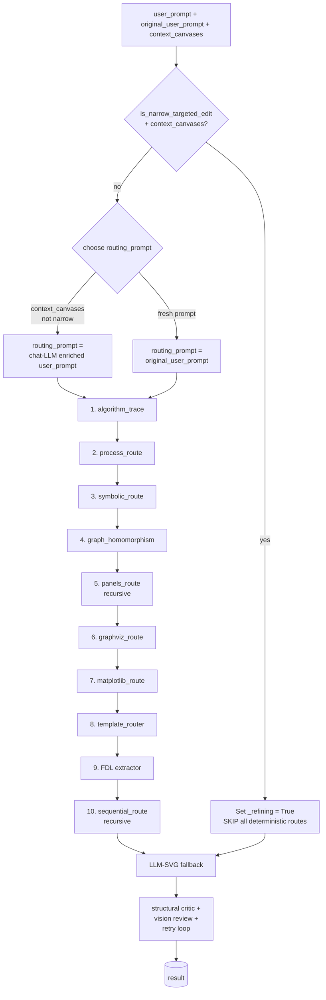
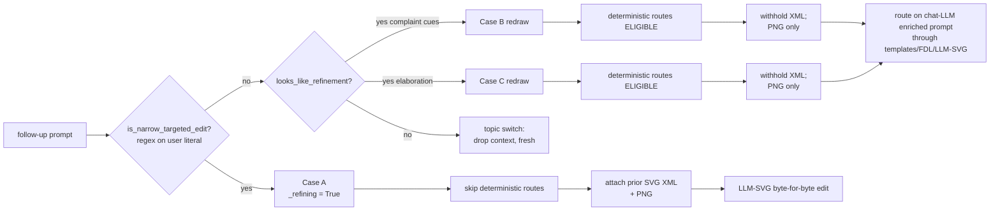

# Pipeline: how `express_figure` builds a figure

Deep-dive on the figure-generation pipeline in
`studio/express.py:express_figure`. Read [ARCHITECTURE.md](../ARCHITECTURE.md)
first for the top-down map; this doc walks every route and shows
exactly when each one fires.

## Entry signature

```python
async def express_figure(
    user_prompt: str,         # the chat-LLM's tool-call prompt (may be paraphrased)
    base_url: str,            # OpenAI / vLLM endpoint
    model: str,               # backend model id
    api_key: str | None,
    max_retries: int = 2,     # vision-review retry budget (3 attempts total)
    context_canvases: list[dict] | None = None,
    on_svg_chunk: Callable[[str], Awaitable[None]] | None = None,
    allow_panels: bool = True,
    allow_sequential: bool = True,
    original_user_prompt: str | None = None,
                              # the user's LITERAL message (no chat-LLM paraphrase)
) -> dict[str, Any]:
    # returns {svg, narration, title, review_history, retries_used,
    #          repairs, template} (template key only when a
    #          deterministic route fired)
```

`original_user_prompt` is threaded through by the chat-loop
(`args["_original_user_prompt"] = req.user`) so deterministic
routing decisions never key off the chat-LLM's reword.

## The route order

The ten routes fire in this fixed sequence. The first match wins.



Every route is gated on a `SEVIM_<NAME>_ROUTE` env var. The
default for all is `on`; set to `off` to disable.

## Per-route catalog

### 1. algorithm_trace

File: `studio/templates/algorithm_trace.py`

Catches: "Show bubble sort step by step", "Gaussian elimination",
"compute the determinant by cofactor expansion", "gcd(48, 18) by
Euclid". The Python implementation runs the algorithm, records
every intermediate state, and renders a vertical stack of
sub-figures with one row per step. By construction every value
is correct.

Gate: `SEVIM_ALGO_TRACE`, `is_algorithm_trace_prompt(routing_prompt)`.

### 2. process_route

File: `studio/templates/process_route.py`

Catches: ordered or cyclic processes — "the cell cycle", "the
scientific method", "Krebs cycle", "water cycle". The LLM
extracts a list of stages with labels and arrows; the renderer
draws either a ring (cyclic) or a vertical flow (linear).

Gate: `SEVIM_PROCESS_ROUTE`, `is_process_prompt(routing_prompt)`.

### 3. symbolic_route

File: `studio/templates/symbolic_route.py`

Catches: derivatives, gradients, Hessians, integrals, limits,
"find and classify critical points of f(x, y)". The LLM extracts
the function + operation; SymPy solves it exactly; matplotlib
typesets the answer.

Gate: `SEVIM_SYMBOLIC_ROUTE`, `is_symbolic_prompt(user_prompt)`.

### 4. graph_homomorphism

File: `studio/templates/graph_homomorphism.py`

Catches: "show a graph homomorphism between K_3 and C_6". The
LLM emits two graphs and a function f: V(G) → V(H); a
deterministic verifier walks edges and confirms f is a
homomorphism before any rendering. Failed verifications block
ship.

Gate: `SEVIM_HOMOM_ROUTE`, `is_homomorphism_prompt(user_prompt)`.

### 5. panels_route (recursive)

File: `studio/templates/panels_route.py`

Catches: "compare bubble sort and insertion sort side-by-side",
"show f(x) = sin x and g(x) = cos x in separate panels". The
route extracts sub-prompts, then **recurses into
`express_figure`** per panel with `allow_panels=False` (one
level of decomposition only), then composites a deterministic
grid.

Gate: `SEVIM_PANELS_ROUTE`, `is_panels_prompt(routing_prompt)`.

### 6. graphviz_route

File: `studio/templates/graphviz_route.py`

Catches: DFA / NFA / Turing machine / DAG / tree / Hasse
diagram / Cayley graph / Petersen graph / generic state
diagram. The LLM emits DOT source; the `dot` binary renders SVG.
Graphviz's layout engine has decades of overlap-avoidance.

The route then calls `narrate_graphviz` (`gpt-4o`) to produce
phrase-timed narration that **references the DOT-emitted node /
edge ids**, so the viewer highlights actual nodes/edges as the
narration plays.

Gate: `SEVIM_GRAPHVIZ_ROUTE`, `is_graphviz_binary_available() and
is_graphviz_prompt(routing_prompt)`.

### 7. matplotlib_route

File: `studio/templates/matplotlib_route.py`

Catches: regression scatter, decision boundaries, SVM,
function curves, 3-D surfaces, contour plots, parametric curves.
The LLM emits a **structured plot spec** (closed vocabulary); a
server-side matplotlib renderer turns it into SVG. **No exec of
LLM code.** Out-of-bounds by construction because matplotlib
manages limits.

Gate: `SEVIM_MATPLOTLIB_ROUTE`, `is_matplotlib_prompt(user_prompt)`.

### 8. template_router

File: `studio/templates/router.py`

The per-template gpt-4o-mini classifier. Picks from this
registered set:

| Template | What it draws |
|---|---|
| `matrix_multiplication` | A·B with intermediate products |
| `matrix_transpose` | Aᵀ |
| `matrix_determinant` | det(A) by cofactor expansion |
| `matrix_inverse` | A⁻¹ via adjugate |
| `system_of_equations` | Ax = b solved step-by-step |
| `state_diagram` | Generic state machine (when graphviz doesn't fit) |
| `pythagoras` | The Pythagorean theorem with squares on each side |
| `number_line` | Number line with marked points |
| `data_table` | A tabular layout |
| `adjacency_matrix` | Graph ↔ adjacency matrix correspondence |
| `place_value` | Primary-school place-value chart |
| `multiplication_array` | Primary-school array model |
| `venn_diagram` | 2- or 3-set Venn diagram |
| `fraction` | Bar or pie fraction model |
| `unit_circle` | Trig values at named angles |
| `triangle` | Generic labelled triangle |
| `newton_method` | Newton's method with real SymPy-slope tangents |
| `volume_of_sphere` | Side-view sphere + disk slice + integral derivation |
| `volume_of_cone` | Side-view cone + disk slice + integral derivation |

The classifier returns `(name, args)` or `null`. The named
template's `render_template(name, args)` produces `(svg,
narration)`. If args fail validation, the router falls through to
FDL.

Anti-rules in the classifier prompt prevent keyword hijacks
(e.g. `newton_method` must NOT swallow "where do f and g
intersect" — that belongs to FDL Intersection).

Gate: `SEVIM_TEMPLATE_ROUTER`, classifier returns non-null.

### 9. FDL (Figure Description Language) — fallback

File: `studio/templates/fdl.py`

For prompts that don't pin to a specific template but ARE
graphable, FDL composes the figure from ten primitives:

| Primitive | What it draws | Real-math guarantee |
|---|---|---|
| `Plot` | A curve y = f(x) over [x_min, x_max] | sampled, in-bounds-clipped |
| `AxisMark` | A labelled tick on an axis | — |
| `MarkPoint` | A dot on a named curve at x = X | y = f(X) computed by SymPy |
| `TangentAt` | A tangent line at (X, f(X)) | slope = f'(X) via SymPy.diff |
| `Caption` | Right-margin explanatory text | word-wrapped to margin |
| `Secant` | A line through two points on a curve | slope = (f(b)-f(a))/(b-a) |
| `Intersection` | Where two curves meet | SymPy.solve(f(x) = g(x)) |
| `ShadeUnder` | Area under a curve over [a, b] | polygon, closed to x-axis |
| `RegionBetween` | Area between two curves | polygon between f and g |
| `Vector` | An arrow from (x_a, y_a) to (x_b, y_b) | with arrowhead marker |

The FDL extractor (`llm_extract_scene`) is a gpt-4o-mini call
with a JSON-schema-constrained response. It returns a `Scene`
of primitives + a narration array. The renderer composes the
SVG; per-phrase highlight ids are derived by
`_phrase_highlights` (see below).

Cluster zoom: when MarkPoints / TangentAts cluster into <30% of
the natural plot width (typical Newton convergence), the plot
range zooms to the cluster ± 20% padding so the iterates don't
pile on top of each other.

Composition rules baked into the extractor prompt:

- "Tangent at x = N" → MUST emit BOTH a MarkPoint AND a TangentAt
  at that x.
- "Newton's method" → MUST emit MarkPoint + TangentAt(mode="to_zero")
  for each iterate.
- "Where f and g intersect" → BOTH plots with labels 'f' and 'g'
  + an Intersection primitive.
- At least TWO captions, the last one starting with
  `CONCLUSION:`.
- Plot range padded to keep every MarkPoint / TangentAt visible.
- Numbers spelled out as words in non-English narration.

Y-axis: always drawn. At x=0 when 0 is in the plot window,
otherwise at the left edge so the figure still has the
familiar two-axis look (memory `feedback_show_figure_immediately`).

Gate: `SEVIM_FDL_ROUTE`, `llm_extract_scene` returns a Scene.

### 10. sequential_route (recursive) — last in line

File: `studio/templates/sequential_route.py`

Catches genuinely sequential prompts that nothing above caught
("explain the writing process step by step", "Krebs cycle steps").
Decomposes into ordered sub-prompts, recurses into
`express_figure(allow_sequential=False)` per step, stacks the
sub-figures vertically.

Gate: `SEVIM_SEQUENTIAL_ROUTE`, `is_sequential_prompt(routing_prompt)`.

Sequential is **last** by design. An earlier ordering had it
before the template router, which decomposed Newton's-method
prompts into LLM-drawn sub-figures and lost convergence accuracy;
moved here so iterative-math prompts hit the deterministic newton
template first.

### LLM-SVG fallback (when all 10 miss)

The catch-all path:

1. **Completeness classify + brief.** The user's question is
   classified into one of nine pedagogical archetypes
   (proof / step_by_step / why / compare / define / explain /
   construct / apply / quick_fact). The rubric brief for that
   archetype is appended to `_EXPRESS_SYSTEM` so the figure LLM
   sees the depth contract up front. See
   [COMPLETENESS.md](COMPLETENESS.md).
2. gpt-4o emits `{problem_statement, solution, math_claims, svg,
   narration, title}` as one JSON object (structured-output mode).
3. **Tier 2/3 math verifier** (SymPy → Z3 → Lean → per-domain
   structural) checks every `math_claims` entry.
4. **Tier 5 figure_ground_truth** independently proposes claims
   from the prompt and validates them via SymPy.
5. **Structural critic** (`_structural_review`) runs deterministic
   checks on the rendered SVG (see [QUALITY_GATES](QUALITY_GATES.md)).
6. **Completeness critic** (`completeness_review`) checks the
   produced primer + narration against the archetype's required
   components + length range.
7. **Vision review** (`_vision_review`, gpt-4o on the rendered PNG
   + narration) catches what code can't.
8. If any of the above fail, format the issues as a critique and
   **retry** (up to `max_retries`, default 2 → 3 total attempts).
9. After exhausting retries, ship the BEST attempt
   (`_attempt_score` over all retries — the 3-SAT regression where
   attempt 0 had 1 overlap pair and attempt 2 had 5 forced this).

## Refinement mode (in detail)

When `context_canvases` is non-empty (i.e. `_execute_tool`
loaded the prior canvas), three sub-cases:



Patterns matched by `is_narrow_targeted_edit`:

- `change\s+(?:the\s+)?\w+\s+(?:colou?r\s+)?to\s+\w+`
- `colou?r\s+(?:the\s+|it\s+)\w+\s+\w+`
- `make\s+(?:the\s+|it\s+)\w+`
- `add\s+(?:a\s+|an\s+|the\s+)?\w+`
- `remove\s+(?:the\s+|that\s+)?\w+`
- `delete\s+(?:the\s+|that\s+)?\w+`
- `highlight\s+(?:the\s+|that\s+)?\w+`
- `relabel\s+|\brename\s+`
- `rotate\s+|\bmove\s+|\bscale\s+`

The detailed multi-turn walkthrough is in
[REFINEMENT.md](REFINEMENT.md).

## How to add a new template

Recipe for a new deterministic template
(say, `riemann_sum`):

1. **Write the renderer.** Create
   `studio/templates/riemann_sum.py` with:
   ```python
   def riemann_sum(*,
       f: str,        # SymPy-parseable expression in x
       a: float, b: float,
       n: int = 8,
       mode: str = "left",  # "left" / "right" / "midpoint"
       title: str = "",
   ) -> Tuple[str, List[dict]]:
       svg = _build_svg(...)
       narration = [
           {"speak": "...", "highlight": ["rect_0", "curve"]},
           ...
       ]
       return svg, narration
   ```
   Every primitive gets an `id="rect_<i>"` etc. so the narration
   highlights match. Each `speak` phrase is one sentence.

2. **Register it.** In `studio/templates/router.py`:
   ```python
   from .riemann_sum import riemann_sum

   TEMPLATES = {
       ...,
       "riemann_sum": riemann_sum,
   }
   ```
   Add the classifier description block to the system prompt:
   ```
   riemann_sum — "Riemann sum", "approximate the integral via
     rectangles", "show left/right/midpoint sum for f on [a, b]"
     args: {"f": "...", "a": <num>, "b": <num>, "n": <int>,
            "mode": "left|right|midpoint", "title": "<optional>"}
     PARSE f from the prompt.  Default n=8, mode="left".
   ```

3. **Add a test.** `tests/test_riemann_sum.py`:
   ```python
   def test_riemann_left_sum_renders():
       svg, narr = riemann_sum(f="x**2", a=0, b=2, n=4, mode="left")
       assert '<rect' in svg
       assert len(narr) >= 3
       # check rect count matches n
       assert svg.count('<rect') >= 4
   ```

4. **No bare LLM-SVG fallback.** If `render_template` rejects the
   args, the router falls through to FDL or LLM-SVG; that's fine.
   Don't add a per-template "if no template, draw freehand"
   branch (memory `feedback_deterministic_routes_no_fallback`).

5. **Run the quality gate.** Before deploying:
   ```bash
   SEVIM_QUALITY_GATE_FAST=1 python infra/quality_gate.py
   ```
   Add at least one Riemann prompt to the gate's prompt set
   (in `infra/quality_gate.py`) so future regressions are
   caught.

6. **Deploy.** `cd infra && ./deploy.sh`.

## How to add a new FDL primitive

Same flow as a template but inside `fdl.py`:

1. Add a `@dataclass class MyPrim:` matching the existing pattern.
2. Add it to the `Primitive = Plot | … | MyPrim` union.
3. Extend `SCENE_SCHEMA` with the new `kind` literal + its
   structured args.
4. Add a `Pass N` rendering block in `render_scene` that emits
   `<line id="myprim_<i>"…>` etc.
5. Extend `_phrase_highlights` to recognise narration phrases
   that name your primitive (if relevant).
6. Add a worked example to `_EXTRACTOR_SYSTEM`.
7. Add a test in `studio/templates/test_fdl_*.py`.
