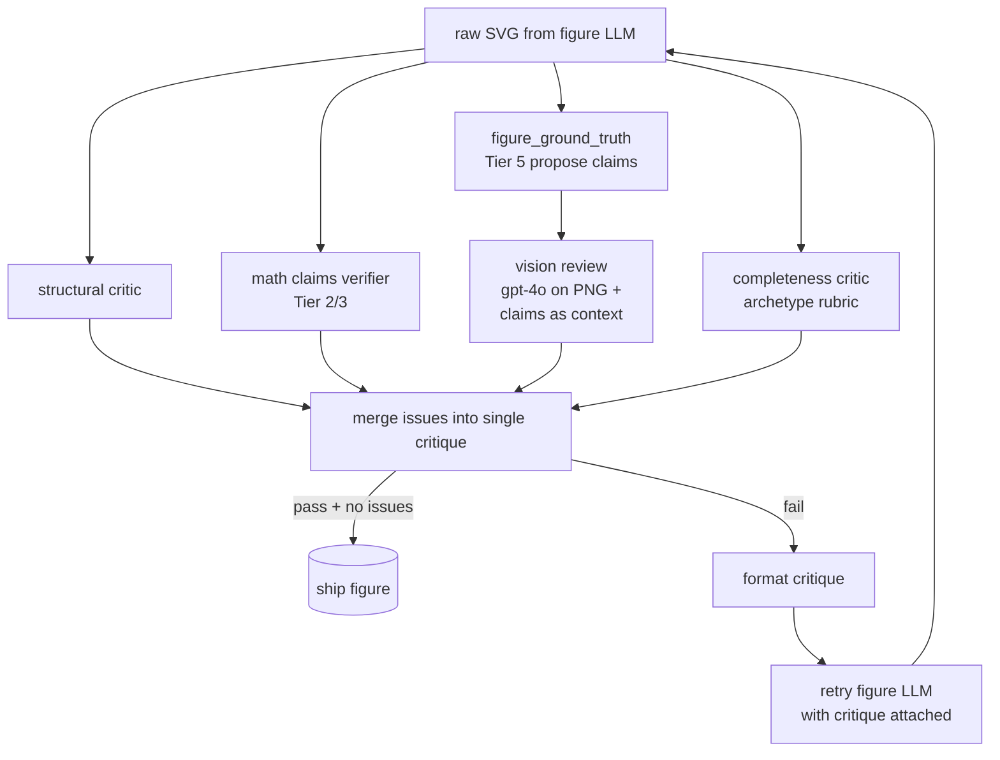
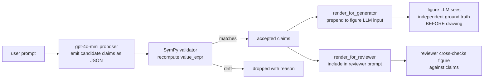
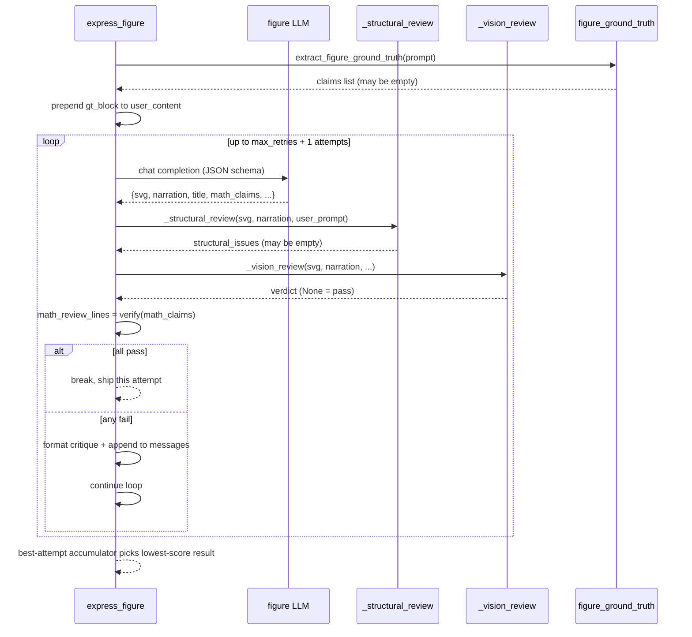
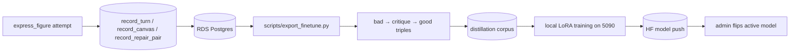

# Quality gates — review, structural critic, ground truth

Every figure on the LLM-SVG path passes four quality gates
before it ships:

1. **Structural critic** — deterministic Python checks on the
   raw SVG + narration.
2. **Math verifier chain** — Tier 2/3 SymPy / Z3 / Lean
   verification of `math_claims`.
3. **Vision review** — gpt-4o on the rendered PNG +
   independent Tier 5 ground-truth claims.
4. **Completeness critic** — pedagogical-depth check against
   the rubric for the question's archetype. Sister gate to
   the structural critic; see [COMPLETENESS.md](COMPLETENESS.md)
   for the full design.

If any gate fails, the failure is formatted as a critique and the
figure LLM is retried with that critique attached (up to
`max_retries`, default 2 → 3 total attempts). All four gates
share the same retry budget — issues from any combination are
merged into one critique block per attempt.

Deterministic templates (newton, sphere, cone, matrix, …) skip
all four gates by design: they are correct + complete by
construction.

This doc walks the first three gates; completeness has its own
deep-dive at [COMPLETENESS.md](COMPLETENESS.md).



## The structural critic

File: `studio/express.py:_structural_review(svg, narration, user_prompt="")`

Pure-Python deterministic checks. No LLM, no network. Returns a
list of issue strings; empty list = pass.

The rules, in order, with what they catch:

| Rule | What it detects | Why it's a deterministic check |
|---|---|---|
| `narration_highlight_id_missing` | Narration `highlight` arrays reference SVG ids that don't exist in the emitted SVG | The viewer's spotlight only fires when `document.getElementById` succeeds; missing ids = silent no-flash failure |
| `narration_no_highlights` (4+ phrases all empty) | Narration plays with no visual cue for every phrase | Detects the "no item was highlighted" learner complaint |
| `missing_required_primitive` | Topic-specific primitive missing (e.g. function-graph prompt with no `<path>` Bezier curve) | A "Riemann sum" without rectangles teaches nothing; vision LLM is unreliable on this category |
| `micro_figure` | 5+ primary geometric primitives at <8 px size — usually the LLM put the user's `r = 5` as the actual `<circle r=5>` rather than as a `<text>` label | Catches a recurring class where SEMANTIC values become viewBox coords |
| `shape_outside_zone` | A shape extends past the SHAPE_ZONE bounds (when the figure uses zone architecture with named text-region groups) | Out-of-bounds shapes collide with text regions; the LLM doesn't reliably enforce zones |
| `text_text_overlap` | Two `<text>` elements with visibly overlapping bounding boxes | The vision LLM under-reports overlap; structural critic uses actual font metrics |
| `caption_overlaps_shape` | A caption text bbox lands inside a polygon / circle / rect interior | Hides labels inside shapes; deterministic geometric check |
| `arrowhead_inside_node` | A marker-end arrowhead lands inside the target node circle/rect | Visually wrong; caused by edge endpoints not being clipped to node boundaries |
| `served_svg_invalid_xml` | The served SVG fails to parse as valid XML | Catches truncation, unclosed tags, ampersand escaping bugs |
| `legibility_floor` | A `<text>` with font-size < 8 px | Unreadable on the canvas; LLM occasionally emits 4-6 px text |
| `crowded_markers` | 3+ marker dots with 2+ pairs within 20 px of each other | Iterate clusters that need cluster zoom (Newton convergence) |
| `tangent_without_function_spec` | Narration says "tangent" but the user's prompt has no `f(x) = …` and no `x_0` | The figure LLM drew generic lines that may not be tangent; force a retry with concrete defaults |
| `lies_on_violation` | A point claimed to lie ON a curve is rendered visibly off it | Catches "the dot is supposed to be on the curve" failures |
| `function_plot_no_curve` | Prompt names a function but the SVG has no `<path>` with C/Q Bezier or `>=6`-point polyline | Most "draw f(x) = …" failures collapse to "the curve wasn't drawn at all" |

Each rule formats a self-contained critique string that the
retry can act on. Example:

```
crowded_markers: 5 marker dot(s) on the figure, with 3 pair(s) less
than 20 px apart. Stacking the iterates on top of each other makes
them unreadable. When successive iterates (x_0, x_1, x_2, ...)
converge to a tight cluster, ZOOM the plot window to the cluster's
range + ~20% margin so each dot is drawn at a visibly distinct
screen position. Re-draw with: xmin = min(iterates) - 0.20*W, xmax
= max(iterates) + 0.20*W where W is the cluster width. Each iterate
label must sit next to its dot, not stacked vertically.
```

### `_is_visual_only_issues` — when to retry, when to ship

When the vision review PASSes (model didn't see a problem in the
rendered PNG) but the structural critic complains about visual-only
issues (text-text overlap, caption-on-shape, oversized element,
…), we **stop retrying** and ship. Why: retries on visual-only
issues often REGRESS the figure (a 3-SAT case had attempt 0 with
1 overlap pair, attempt 1 with 5). Functional issues
(`missing_required_primitive`, `narration_highlight_id_missing`,
math-claim failures) still gate retries.

## The vision review

File: `studio/express.py:_vision_review(...)`

Calls a reviewer LLM (default `gpt-4o`, mode `vision`) with:

- the rendered SVG as a PNG (via `_svg_to_png`),
- the narration script,
- the `math_claims` list,
- the Tier 5 figure_ground_truth block.

Returns either `None` (PASS) or a formatted critique string of
ACTION items: `[action] description -- at: where -- details: …`.

The reviewer system prompt has explicit rules for:

- **Default to PASS** for visual polish. Partial figures and
  missing-but-non-essential captions are PASS.
- **NEVER FAIL on highlight ids.** Those are checked by the
  structural critic; don't second-guess.
- **FAIL on broken-figure problems**: orphan leaders to empty
  canvas, notation mismatches, main content missing, text
  overlap, empty placeholder shapes, missing defining content,
  wrong topology, wrong topic, oversized elements, irrelevant
  elements.
- **FAIL on math-correctness problems**: factually wrong claims
  in narration / captions / labels, claim ↔ figure mismatches,
  geometric impossibilities (collinear-but-bent, point-off-circle,
  angle-marked-90°-but-isn't).
- **NARRATION ↔ FIGURE GEOMETRIC VOCABULARY MUST MATCH.** A line
  labelled "tangent" must touch the curve at one point with the
  curve's local slope; "perpendicular" must meet at a visible
  right angle; "parallel" must not converge or diverge; "crosses
  the x-axis at x = 3" must visibly cross at x = 3.

Action set: `add_label`, `add_element`, `highlight_relation`,
`fix_layout`, `fix_notation`, `fix_caption_text`,
`fix_narration_phrase`.

Mode + model are admin-configurable:
- `SEVIM_REVIEW_MODE` ∈ {`vision`, `text`, `off`} (default `vision`)
- `SEVIM_REVIEW_MODEL` (default `gpt-4o`)
- `SEVIM_REVIEW_URL`, `SEVIM_REVIEW_KEY_ENV` for non-OpenAI reviewers.

## Tier 5 figure ground truth (independent claims)

File: `studio/templates/figure_ground_truth.py`



A claim is one of:

- `position` — "x_1 should be at coordinate 1.5 on the x-axis"
- `value` — "the figure should display the numeric value 6"
- `slope` — "the tangent line at x_0 should have slope 12"
- `relation` — "the max is above the x-axis", "x_1 is left of x_0"
- `presence` — "the curve must visibly cross zero at x ≈ 1.26"

Each claim carries a SymPy-parseable `value_expr` (e.g.
`diff(x**3 - 2, x).subs(x, 2)` → 12) that the validator
re-evaluates. Drift → claim dropped.

Why this matters: the figure LLM emits its OWN
`math_claims` list, which can be wrong (the LLM can claim
`f'(2) = 6` when it's actually 12). Tier 5 proposes claims
INDEPENDENTLY of the figure LLM, so a wrong figure-LLM claim
can't bias the proposer into agreement.

Empty claim list is correct and expected for vague /
non-mathematical prompts ("draw something pretty"). The route
won't fail-block on those.

## The retry loop



Best-attempt accumulator: every attempt records `(svg, narration,
title, structural_issue_count, vision_verdict)`. If all attempts
fail, the loop ships the LOWEST-score attempt (not the last).

## Pre-deploy quality gate

A second-layer gate sits in `infra/quality_gate.py`. Runs as
part of `infra/deploy.sh` BEFORE `cdk deploy`. 50+ criteria over
a fixed prompt set:

| Category | Examples |
|---|---|
| Routing | "deterministic route selected", "homomorphism route fired" |
| Layout | "text inside viewBox", "arrowheads sized to stroke", "3D aspect cube", "no arrowhead inside node" |
| Typography | "SVG text kept as `<text>`", "legibility floor ≥ 8 px" |
| Math correctness | "math verifier outcome logged", "math verifier accepted final attempt", "imperative prompt reaches answer" |
| Narration | "narration phrases produced", "narration avoids boilerplate opener" |
| Security | "/openapi.json returns 404", "no Server: uvicorn header", "HSTS header present", "no internals leaked to client SVG" |
| UX | "figure visible from start", "/studio/feedback accepts reports" |
| Performance | "TTFB < 8s", "total < 90s" |

Failing the gate **blocks the deploy**.

Bypasses:

```bash
SEVIM_SKIP_QUALITY_GATE=1 infra/deploy.sh  # emergency hotfix
SEVIM_QUALITY_GATE_FAST=1 infra/deploy.sh  # 3-prompt subset
```

`feedback_deploy_wrapper` memory: never use bare `cdk deploy`.

## Tools an admin can use post-deploy

| Endpoint | What it shows |
|---|---|
| `/studio/admin` | Index of admin views |
| `/studio/admin/stats` | Session / cost / turn counts |
| `/studio/admin/users-summary` | Distinct-people stats (email-keyed) |
| `/studio/admin/models` | Current backend (gpt-4o / Qwen) |
| `/studio/admin/problems` | Problem-pattern view (user-flagged figures) |
| `/studio/admin/feedback` | "Not quite right?" reports + resolve workflow |
| `/studio/admin/lean` | Offline Mathlib catalog verifier results |
| `/studio/admin/diagnose` | LLM auto-diagnosis on a given canvas |

All gated by `SEVIM_AUTH_REQUIRED=1` + the magic-link cookie of
the admin email (memory `project_self_awareness_2026_05_19`).

## Telemetry → distillation feedback loop

Every figure attempt is recorded:



So a structural critic failure today becomes a (bad, critique,
good) triple that the next fine-tune learns to never make. The
catalog of automated checks here directly shapes what the model
gets better at.
