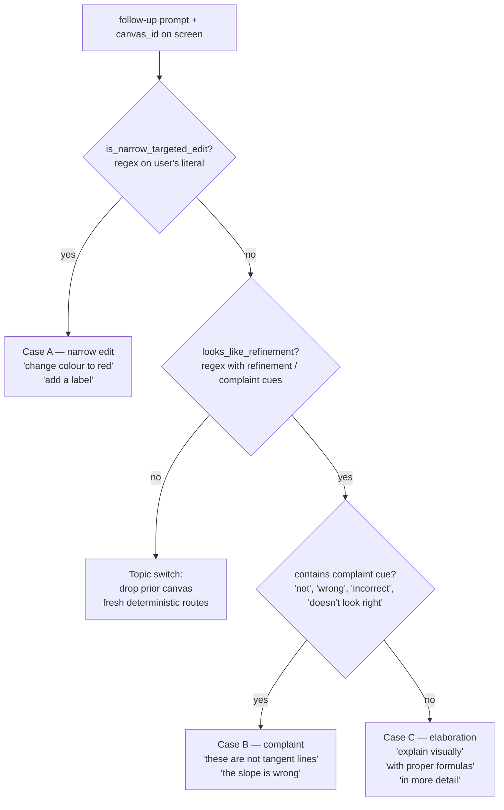
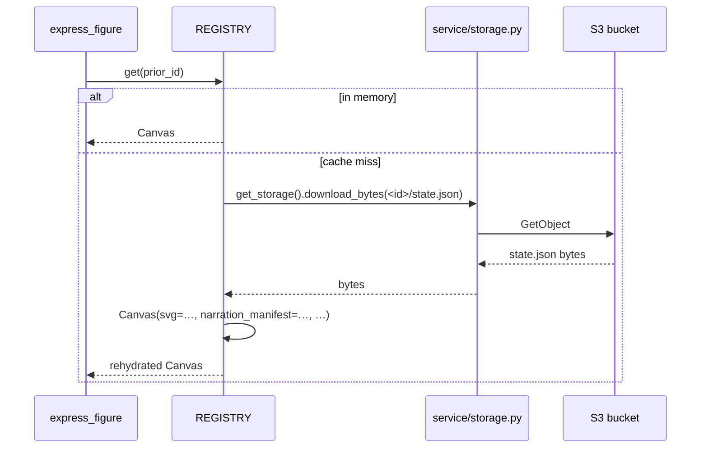

# Refinement: conversation-awareness in three cases

How Khayyam Math handles "the second turn" — when a user already
has a figure on screen and types a follow-up. The system has to
decide:

- Is this a small change to the figure, a complaint, a request
  for more depth, or a brand-new topic?
- Should the chat-LLM redraw, reply in chat, or both?
- Should refinement mode kick in, and if so, what does "preserve"
  mean?

The model has three cases for refinement plus a "topic switch"
escape hatch.

## The four cases at a glance



| | Case A | Case B | Case C | Topic switch |
|---|:---:|:---:|:---:|:---:|
| context_canvases attached | ✅ | ✅ | ✅ | ❌ |
| `_refining = True` (skip det. routes) | ✅ | ❌ | ❌ | ❌ |
| Prior SVG XML sent to figure LLM | ✅ | ❌ (PNG only) | ❌ (PNG only) | n/a |
| `routing_prompt` source | user's literal | chat-LLM enriched | chat-LLM enriched | user's literal |
| Expected new narration phrase count | 1-3 (the edit only) | 1-3 (short ack) | 5-7 (full walkthrough) | 5-7 (fresh figure) |
| Chat-LLM apologises | no | yes (real-conversation tone) | no (treat as a positive request) | no |

## End-to-end flow

```mermaid
sequenceDiagram
    autonumber
    participant FE as Frontend
    participant LOOP as studio/app.py<br/>chat-loop
    participant EXEC as _execute_tool
    participant REG as REGISTRY
    participant EXP as express_figure
    participant LLM as Figure LLM

    FE->>LOOP: POST /chat<br/>{user, canvas_id, history}
    LOOP->>LLM: chat completion<br/>(tool_choice=auto)
    LLM-->>LOOP: tool_call sevim_express(prompt)<br/>OR chat-only text

    Note over LOOP: If tool_call fired —
    LOOP->>LOOP: args["context_canvas_ids"] = [canvas_id]<br/>(always, when canvas_id is set)
    LOOP->>LOOP: args["_original_user_prompt"] = req.user
    LOOP->>EXEC: _execute_tool(args)
    EXEC->>EXEC: looks_like_refinement(original_user_prompt) ?
    alt no refinement cue
        EXEC->>EXEC: drop context (topic switch)
    else has refinement cue
        EXEC->>REG: REGISTRY.get(prior_id)
        REG->>REG: rehydrate from S3 if needed
        REG-->>EXEC: prior Canvas
        EXEC->>EXP: express_figure(context_canvases=[…])
    end

    EXP->>EXP: _refining = bool(context_canvases) AND<br/>  is_narrow_targeted_edit(original)
    alt Case A (narrow edit)
        EXP->>EXP: SKIP all deterministic routes
        EXP->>LLM: REFINEMENT MODE Case A<br/>SVG XML + PNG attached
        LLM-->>EXP: edited SVG (preserve byte-for-byte)
    else Case B / C
        EXP->>EXP: routing_prompt = chat-LLM enriched
        EXP->>EXP: try deterministic routes
        alt match
            EXP-->>LOOP: fresh template figure
        else miss
            EXP->>LLM: REFINEMENT MODE Case B/C<br/>PNG attached, XML withheld
            LLM-->>EXP: fresh redraw of same concept
        end
    end
    EXP-->>LOOP: result
    LOOP-->>FE: SSE tool_result
```

## Worked example: four-turn session

The same Newton's-method session, four turns, one per case.

### Turn 1 — fresh prompt

> **User:** Please explain Newton's method for finding roots
> step by step in an example.

- canvas_id = None (no prior canvas) → `context_canvas_ids = []`
- chat LLM calls `sevim_express(prompt="Newton's method on
  f(x) = x³ - 2 with x₀ = 2 ...")` (concrete defaults supplied
  per SYSTEM_PROMPT directive)
- express_figure: `context_canvases = []` → `_refining = False`
- Template router classifies → `newton_method(f="x**3 - 2",
  x0=2, n_iter=4)`
- Deterministic template fires. 6 narration phrases. retries_used
  = 0. Math-correct by construction.

### Turn 2 — chat-only question

> **User:** How did you calculate x₁?

- canvas_id = `<turn-1 canvas>`, chat history carries Turn 1.
- chat LLM decides this is a clarifying question →
  **no tool call**. Replies in chat:
  > "Newton's method uses x_{n+1} = x_n − f(x_n)/f'(x_n). At
  > x₀ = 2 we have f(2) = 6 and f'(2) = 12, so x₁ = 2 − 6/12 =
  > 1.5."
- Express never runs. The Turn 1 canvas stays on screen.

### Turn 3 — Case A (narrow edit)

> **User:** Please change the colour of the function curve to red.

- chat LLM calls sevim_express. context_canvas_ids = [Turn 1
  canvas].
- `looks_like_refinement("Please change the colour of the
  function curve to red.")` → matches `change|colour|change\s+...
  to\s+...` → True.
- REGISTRY.get loads Turn 1's SVG.
- `is_narrow_targeted_edit(literal)` matches `change ... to red`
  → `_refining = True`.
- Deterministic routes SKIPPED. `_build_user_content` attaches
  Turn 1's SVG XML + PNG. REFINEMENT MODE Case A.
- Figure LLM edits the SVG byte-for-byte: same iterates, same
  tangents, same labels, just `stroke="red"` on the curve.
- 1-3 narration phrases describing the edit ("Curve recoloured.").

### Turn 4 — Case B (complaint)

> **User:** These are not tangent lines.

- chat LLM calls sevim_express. context_canvas_ids = [Turn 3
  canvas].
- `looks_like_refinement("these are not tangent lines")` →
  matches `these|not|tangent` → True.
- REGISTRY.get loads Turn 3's SVG.
- `is_narrow_targeted_edit("these are not tangent lines")` →
  False (no `change … to …` or `add` or `remove`).
- `_refining = False`. Deterministic routes ELIGIBLE.
- `routing_prompt` = chat-LLM's enriched prompt (e.g.
  "Illustrate Newton's method on f(x) = x³ - 2 ...").
- Newton template fires AGAIN. Real SymPy-slope tangents by
  construction. The defect is fixed.
- `_build_user_content` would have only attached the PNG (no SVG
  XML), but since a deterministic template fired, the figure
  LLM never ran.
- Chat reply: "Right, the slopes were off — let me redraw with
  the real tangent slope f'(x_n) = 2x_n at each iterate."

### Turn 5 — Case C (elaboration)

> **User:** Explain visually and with proper formulas.

- chat LLM calls sevim_express. context_canvas_ids = [Turn 4
  canvas].
- `looks_like_refinement` matches `explain|visually|with proper
  formulas` → True.
- `is_narrow_targeted_edit` → False.
- `_refining = False`. routing_prompt = chat-LLM's enriched
  prompt (carries Newton topic).
- Newton template fires. 6-9 narration phrases.
- Chat reply: brief acknowledgement that the redraw adds the
  formula derivation.

### Turn 6 — topic switch

> **User:** Show the Pythagorean theorem with a 3-4-5 triangle.

- chat LLM calls sevim_express. context_canvas_ids = [Turn 5
  canvas].
- `looks_like_refinement("Show the Pythagorean theorem with a
  3-4-5 triangle.")` → no refinement keywords match → False.
- context_canvases dropped. Fresh prompt.
- Template router → `pythagoras(triangle=(3,4,5))`. Clean
  topic switch; the Newton canvas is replaced.

## What "preserve byte-for-byte" actually means (Case A)

On Case A the figure LLM gets:

```
=== REFINEMENT MODE ===
1 prior figure(s) are attached below. For each, you'll see
(a) the SVG XML, (b) the rendered PNG, (c) the prompt that
produced it, (d) its narration script.

FIRST, CLASSIFY THE NEW REQUEST. Three cases:

  CASE A — NARROW targeted edit. ...
    Preserve every unchanged element BYTE-FOR-BYTE — same ids,
    coordinates, text. Do NOT regenerate the layout.

  CASE B — ...
  CASE C — ...

—— PRIOR FIGURE 1 (canvas id=express_…) ——
Original prompt: "Newton's method on f(x) = x^3 - 2 from x = 2"

Its current SVG XML (modify this in place when the user is
refining it):
```xml
<svg …>
  <text id="title" …>Newton's Method for Finding Roots</text>
  <line id="x_axis" …/>
  <polyline id="curve_f" … stroke="#1f77b4" …/>
  …
</svg>
```

<rendered PNG>

=== NEW REQUEST ===
Please change the colour of the function curve to red.
```

The model is asked to edit the SVG XML in place — same ids,
same coordinates, just change `stroke="#1f77b4"` →
`stroke="red"` on `curve_f`. Narration: a 1-3 phrase
acknowledgement of the edit only.

## What Case B and C send instead

The exact same preamble, but:

- Case B text: "Complaint that the prior figure is WRONG. … DO
  NOT preserve it byte-for-byte — copying broken pixels keeps
  them broken. Treat the prior figure ONLY as context to
  understand WHAT the user is pointing at; then DRAW A FRESH
  figure of the SAME CONCEPT, fixing the specific defect the
  user named. Recompute every coordinate, every slope, every
  label position from scratch."
- Case C text: "Elaboration / 'show more' / 'explain visually'.
  The user wants the SAME CONCEPT shown more completely. Like
  Case B: DRAW A FRESH figure, do NOT preserve the prior
  layout. The prior canvas is context for topic continuity
  only."

And crucially: **the SVG XML is NOT attached** on Case B/C.
Only the rendered PNG is sent. The model can't copy text or
coordinates byte-for-byte if it doesn't have the bytes.
Verified live regression on 2026-05-31: with the XML attached,
the model kept the prior captions and stacked the new ones on
top of them.

## REGISTRY rehydration (so this works across ECS deploys)

ECS Fargate tasks are stateless. Every canvas write goes through
`Canvas._persist` to S3 as `<canvas_id>/state.json`. On a
`REGISTRY.get(prior_id)` miss, `_try_rehydrate` reads the blob
from storage and reconstructs the Canvas:



Refinement after a deploy or task replacement works because of
this. Without rehydration, the new task would 404 on the
prior canvas_id and refinement would silently fall back to a
fresh figure.

## Code map

| Concern | File / function |
|---|---|
| Always-attach canvas_id to context | `studio/app.py` chat-loop (`ctx_ids.append(req.canvas_id)`) |
| Refinement-cue regex | `studio/express.py:_REFINEMENT_CUE_RE` + `looks_like_refinement` |
| Narrow-Case-A classifier | `studio/express.py:_NARROW_EDIT_PATTERNS` + `is_narrow_targeted_edit` |
| `_refining` flag | `studio/express.py:express_figure` (top of function) |
| routing_prompt selector | `studio/express.py:express_figure` (`if context_canvases and not is_narrow_…`) |
| Figure-LLM user content | `studio/express.py:_build_user_content` (XML attach gated on `is_narrow_edit`) |
| REFINEMENT MODE preamble | `studio/express.py:_build_user_content` (Cases A/B/C text) |
| REGISTRY get + rehydrate | `service/canvas.py:CanvasRegistry.get` + `_try_rehydrate` |

## Common failure modes (and what fixed them)

- **"Fresh-topic overlay on refinement"** (pre-2026-05-31): when
  the user said "change the curve to red", the deterministic
  newton template fired AGAIN, re-rendering the default-blue
  curve. **Fix:** `_refining` skips templates on Case A.
- **"Lost track of communication"** (2026-05-31): user typed
  "Explain visually and with proper formulas" — the chat-loop
  followed-up but the followup-keyword gate missed the phrase.
  **Fix:** chat-loop always attaches `req.canvas_id` when a
  canvas is on screen; downstream `looks_like_refinement` is the
  actual gate.
- **"Stacked duplicate titles after complaint"** (2026-05-31):
  on Case B/C the figure LLM read captions from the prior PNG
  and dutifully recreated them. **Fix:** withhold the SVG XML on
  Case B/C; PNG-only.
- **"Generic parabola instead of Newton"** (2026-05-31): on
  Case C, FDL routed on the user's literal "Explain visually…"
  which had no Newton context. **Fix:** routing_prompt uses the
  chat-LLM's enriched prompt on Case B/C.
- **"x_n iterate labels stacked on top of each other"**: FDL
  cluster zoom detects when MarkPoints / TangentAts are within
  30% of plot width and zooms in.
